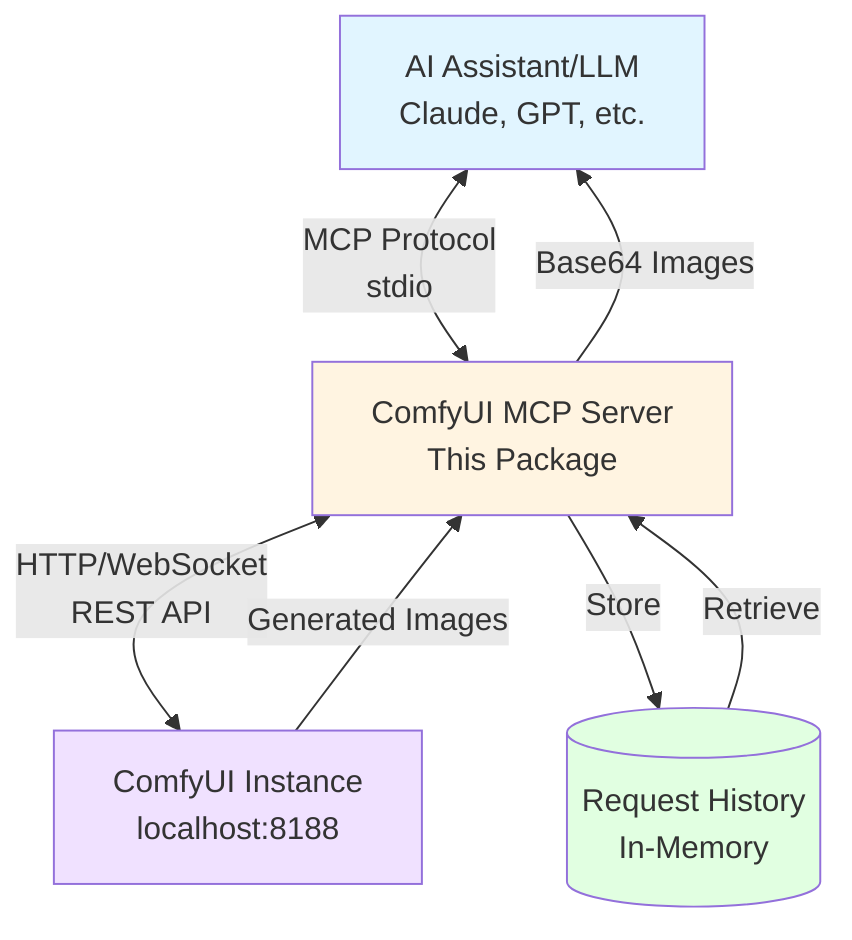

# ComfyUI MCP Server

A Model Context Protocol (MCP) server that enables AI assistants to generate images using a local ComfyUI instance. This server provides seamless integration between MCP-compatible AI tools (like Claude Desktop) and ComfyUI's powerful image generation capabilities.

## Overview

This MCP server exposes three primary tools:
- **`generate_image`**: Queue an image generation task with ComfyUI using a text prompt and optional parameters
- **`get_image`**: Retrieve generated images by their prompt ID
- **`get_request_history`**: View history of all image generation requests with current status

The server communicates with a local ComfyUI instance via its REST API and WebSocket interface, handling workflow execution, queue management, and image retrieval.

### Architecture



**How it works:**
1. Your AI assistant (Claude Desktop, Cline, etc.) sends image generation requests via MCP
2. This server loads your workflow, injects parameters, and queues it to ComfyUI
3. Each request is stored in memory with prompt details, dimensions, and timestamp
4. ComfyUI generates the image using your local GPU/models
5. The server retrieves and returns the image to your AI assistant
6. View request history anytime to recover lost prompt IDs or review past generations

## Features

- 🎨 **User-Defined Workflows**: Use your own ComfyUI workflows exported as JSON
- 🔄 **Asynchronous Execution**: Queue workflows and retrieve results when ready
- 🖼️ **Direct Image Access**: Fetch generated images as base64-encoded data
- ⚙️ **Flexible Parameters**: Inject prompt, width, height into your workflows
- 🔌 **Easy Integration**: Works with any MCP-compatible client via `npx` command
- 📡 **Real-time Updates**: WebSocket support for execution progress tracking

## Prerequisites

- **Node.js**: Version 18.x or higher (LTS recommended)
- **ComfyUI**: Running locally with API access enabled
  - Default: `http://127.0.0.1:8188`
  - Must have a checkpoint model loaded (e.g., SD 1.5, SDXL)

## Installation

### Quick Start - AI IDEs & Tools

Choose your AI tool and follow the configuration:

<details>
<summary><b>Claude Desktop</b></summary>

1. Open your Claude Desktop config file:
   - **macOS**: `~/Library/Application Support/Claude/claude_desktop_config.json`
   - **Windows**: `%APPDATA%\Claude\claude_desktop_config.json`

2. Add the server configuration:
```json
{
  "mcpServers": {
    "comfyui": {
      "command": "npx",
      "args": ["-y", "comfyui-mcp-server"],
      "env": {
        "COMFYUI_URL": "http://127.0.0.1:8188",
        "COMFYUI_WORKFLOW_PATH": "/path/to/your/workflow.json"
      }
    }
  }
}
```

3. Restart Claude Desktop

</details>

<details>
<summary><b>Claude Code</b></summary>

Run this command to install:
```bash
claude mcp add comfyui-mcp-server
```

Or manually edit `claude_desktop_config.json` with the same configuration as Claude Desktop above.

</details>

<details>
<summary><b>Cline (VS Code Extension)</b></summary>

1. Click the **MCP Servers** icon in the Cline panel
2. Click **"Configure MCP Servers"** to open `cline_mcp_settings.json`
3. Add the configuration:
```json
{
  "mcpServers": {
    "comfyui": {
      "command": "npx",
      "args": ["-y", "comfyui-mcp-server"],
      "env": {
        "COMFYUI_URL": "http://127.0.0.1:8188",
        "COMFYUI_WORKFLOW_PATH": "/path/to/your/workflow.json"
      }
    }
  }
}
```

4. Restart VS Code or reload the Cline extension

**Alternative**: Use the Cline MCP Marketplace (click Extensions icon) to find and install with one click.

</details>

<details>
<summary><b>Cursor</b></summary>

1. Open Settings (Cmd/Ctrl + Shift + J)
2. Go to **"Composer" → "Model Context Protocol"**
3. Add the configuration:
```json
{
  "mcpServers": {
    "comfyui": {
      "command": "npx",
      "args": ["-y", "comfyui-mcp-server"],
      "env": {
        "COMFYUI_URL": "http://127.0.0.1:8188",
        "COMFYUI_WORKFLOW_PATH": "/path/to/your/workflow.json"
      }
    }
  }
}
```

4. Restart Cursor

</details>

<details>
<summary><b>Windsurf</b></summary>

1. Open the MCP settings file:
   - **macOS**: `~/Library/Application Support/Windsurf/config.json`
   - **Windows**: `%APPDATA%\Windsurf\config.json`

2. Add the configuration:
```json
{
  "mcpServers": {
    "comfyui": {
      "command": "npx",
      "args": ["-y", "comfyui-mcp-server"],
      "env": {
        "COMFYUI_URL": "http://127.0.0.1:8188",
        "COMFYUI_WORKFLOW_PATH": "/path/to/your/workflow.json"
      }
    }
  }
}
```

3. Restart Windsurf

</details>

<details>
<summary><b>VS Code with GitHub Copilot</b></summary>

1. Install the [MCP Servers extension](https://marketplace.visualstudio.com/items?itemName=modelcontextprotocol.mcp-servers)
2. Open Settings (Cmd/Ctrl + ,) and search for "MCP"
3. Edit `settings.json`:
```json
{
  "mcp.servers": {
    "comfyui": {
      "type": "stdio",
      "command": "npx",
      "args": ["-y", "comfyui-mcp-server"],
      "env": {
        "COMFYUI_URL": "http://127.0.0.1:8188",
        "COMFYUI_WORKFLOW_PATH": "/path/to/your/workflow.json"
      }
    }
  }
}
```

4. Reload VS Code

</details>

<details>
<summary><b>Zed Editor</b></summary>

1. Open the Zed settings file:
   - **macOS**: `~/.config/zed/settings.json`
   - **Linux**: `~/.config/zed/settings.json`

2. Add the configuration:
```json
{
  "context_servers": {
    "comfyui": {
      "command": "npx",
      "args": ["-y", "comfyui-mcp-server"],
      "env": {
        "COMFYUI_URL": "http://127.0.0.1:8188",
        "COMFYUI_WORKFLOW_PATH": "/path/to/your/workflow.json"
      }
    }
  }
}
```

3. Restart Zed

</details>

<details>
<summary><b>Continue (VS Code Extension)</b></summary>

1. Open the Continue extension settings
2. Edit `config.json` (usually in `~/.continue/config.json`):
```json
{
  "mcpServers": {
    "comfyui": {
      "command": "npx",
      "args": ["-y", "comfyui-mcp-server"],
      "env": {
        "COMFYUI_URL": "http://127.0.0.1:8188",
        "COMFYUI_WORKFLOW_PATH": "/path/to/your/workflow.json"
      }
    }
  }
}
```

3. Restart the Continue extension

</details>

### Development Setup

For local development and testing:

```bash
git clone <repository-url>
cd comfyui-mcp
npm install
npm run build
npm link
```

Then reference it in your MCP client config using the local path instead of npx.

## Configuration

### Environment Variables

| Variable | Description | Default |
|----------|-------------|---------|
| `COMFYUI_URL` | Base URL of your ComfyUI instance | `http://127.0.0.1:8188` |
| `COMFYUI_WORKFLOW_PATH` | Path to your exported workflow JSON file | `./workflow.json` |

### ComfyUI Setup

1. **Start ComfyUI** with API enabled:
   ```bash
   python main.py --listen 127.0.0.1 --port 8188
   ```

2. **Export Your Workflow**:
   - Create your desired workflow in ComfyUI
   - Click "Save (API Format)" to export as JSON
   - Save the file (e.g., `workflow.json`)
   - Set `COMFYUI_WORKFLOW_PATH` to point to this file

3. **Verify API Access**:
   ```bash
   curl http://127.0.0.1:8188/system_stats
   ```

## Usage

### Tool 1: `generate_image`

Generate an image using your ComfyUI workflow with the specified parameters. The server will load your workflow JSON and inject the provided parameters.

**Input Schema:**
```typescript
{
  prompt: string;          // Text description of the image to generate
  negative_prompt?: string;// Optional: what should NOT be in the image
  width?: number;          // Image width in pixels (default: 512)
  height?: number;         // Image height in pixels (default: 512)
  workflow_path?: string;  // Optional: override default workflow path
}
```

**How It Works:**
- The server loads your workflow JSON from `COMFYUI_WORKFLOW_PATH`
- It intelligently finds the appropriate nodes to inject parameters (see "Parameter Injection" below)
- Parameters are injected into the appropriate nodes
- The modified workflow is queued to ComfyUI

**Response:**
```typescript
{
  prompt_id: string;       // Unique ID for this generation request
  number: number;          // Position in the queue
  status: string;          // Current status
}
```

**Example:**
```
User: Generate an image of a serene mountain landscape at sunset
AI: [Calls generate_image with prompt="serene mountain landscape at sunset", width=1024, height=768]
Response: { prompt_id: "abc123", number: 1, status: "queued" }
```

### Tool 2: `get_image`

Retrieve a generated image by its prompt ID.

**Input Schema:**
```typescript
{
  prompt_id: string;       // The prompt_id returned from generate_image
}
```

**Response:**
```typescript
{
  status: string;          // "completed", "executing", "pending", or "not_found"
  images?: [{
    filename: string;      // Image filename
    subfolder: string;     // Subfolder path
    type: string;          // Image type (output/temp)
    data: string;          // Base64-encoded image data
  }];
  error?: string;          // Error message if applicable
}
```

**Example:**
```
User: Get the image we just generated
AI: [Calls get_image with prompt_id="abc123"]
Response: {
  status: "completed",
  images: [{
    filename: "ComfyUI_00001_.png",
    data: "iVBORw0KGgoAAAANSUhEUg..."
  }]
}
```

### Tool 3: `get_request_history`

Retrieve the history of all image generation requests made through this server. Useful for recovering lost prompt IDs or reviewing past generations.

**Input Schema:**
```typescript
{
  // No parameters required
}
```

**Response:**
```typescript
{
  history: [{
    prompt_id: string;           // Unique ID for this request
    prompt: string;              // The positive prompt used
    negative_prompt?: string;    // The negative prompt (if provided)
    width: number;               // Image width
    height: number;              // Image height
    timestamp: string;           // ISO timestamp when request was made
    status: string;              // Current status: "queued", "executing", "completed", "failed"
    queue_position?: number;     // Position in queue when submitted
  }];
  total_requests: number;        // Total number of requests
}
```

**Example:**
```
User: Show me my recent image generation requests
AI: [Calls get_request_history]
Response: {
  history: [
    {
      prompt_id: "abc123",
      prompt: "serene mountain landscape at sunset",
      negative_prompt: "people, buildings",
      width: 1024,
      height: 768,
      timestamp: "2025-01-15T10:30:00.000Z",
      status: "completed",
      queue_position: 1
    },
    {
      prompt_id: "def456",
      prompt: "cyberpunk city at night",
      width: 512,
      height: 512,
      timestamp: "2025-01-15T10:25:00.000Z",
      status: "completed",
      queue_position: 1
    }
  ],
  total_requests: 2
}
```

**Note:** Request history is stored in memory and will be lost when the server restarts.

## Architecture

This server follows a layered architecture:

1. **MCP Layer**: Handles protocol communication via stdio transport
2. **Tool Layer**: Implements `generate_image` and `get_image` tools
3. **ComfyUI Client Layer**: Manages HTTP/WebSocket communication with ComfyUI
4. **Workflow Loader**: Loads user-provided workflow JSON and injects parameters

See [ARCHITECTURE.md](./ARCHITECTURE.md) for detailed technical design.

## Workflow Setup

### Creating Your Workflow

1. **Design in ComfyUI**: Create your workflow with the desired nodes (text-to-image, img2img, etc.)
2. **Export as JSON**: Click "Save (API Format)" - this exports the workflow in the format the API expects
3. **Configure Path**: Set `COMFYUI_WORKFLOW_PATH` environment variable to point to your JSON file

### Parameter Injection

The server uses an intelligent parameter injection strategy to work with a wide variety of ComfyUI workflows:

#### How It Works

1. **Prompt Injection (Positive & Negative)**
   - Finds the `KSampler` node in your workflow
   - Follows the `positive` connection to locate the positive prompt `CLIPTextEncode` node
   - Follows the `negative` connection to locate the negative prompt `CLIPTextEncode` node
   - Injects your `prompt` into the positive node's `text` input
   - Injects your `negative_prompt` (if provided) into the negative node's `text` input
   - **Fallback**: If no KSampler is found, uses the first `CLIPTextEncode` node for the positive prompt

2. **Dimension Injection**
   - Searches for `EmptyLatentImage` (SD1.5/SDXL) or `EmptySD3LatentImage` (SD3) nodes
   - Injects `width` and `height` parameters into the node's inputs

This approach ensures the server correctly identifies positive and negative prompts by following the actual connections in your workflow, rather than guessing based on node order.

#### Example Workflow Structure

Here's how a typical workflow is structured and how parameters are injected:

```json
{
  "3": {
    "class_type": "KSampler",
    "inputs": {
      "positive": ["6", 0],    // ← Server follows this to node "6"
      "negative": ["7", 0],    // ← Server follows this to node "7"
      "latent_image": ["5", 0]
    }
  },
  "6": {
    "class_type": "CLIPTextEncode",
    "inputs": {
      "text": "default positive prompt",  // ← Replaced with your prompt
      "clip": ["4", 1]
    }
  },
  "7": {
    "class_type": "CLIPTextEncode",
    "inputs": {
      "text": "",  // ← Replaced with your negative_prompt (if provided)
      "clip": ["4", 1]
    }
  },
  "5": {
    "class_type": "EmptyLatentImage",
    "inputs": {
      "width": 512,   // ← Replaced with your width
      "height": 512,  // ← Replaced with your height
      "batch_size": 1
    }
  }
}
```

#### Supported Node Types

| Node Type | Purpose | Injected Parameters |
|-----------|---------|-------------------|
| `KSampler` | Sampler node (used to trace connections) | None directly |
| `CLIPTextEncode` | Text prompt encoding | `prompt` or `negative_prompt` via KSampler connections |
| `EmptyLatentImage` | Latent image initialization (SD1.5/SDXL) | `width`, `height` |
| `EmptySD3LatentImage` | Latent image initialization (SD3) | `width`, `height` |

#### Requirements for Your Workflow

For the server to work correctly with your workflow:

1. **Must have**: A `KSampler` node with `positive` and `negative` inputs
2. **Must have**: `CLIPTextEncode` nodes connected to the KSampler's positive/negative inputs
3. **Must have**: An `EmptyLatentImage` or `EmptySD3LatentImage` node for dimension control
4. **Export format**: Use ComfyUI's "Save (API Format)" option to export your workflow

## Development

### Build
```bash
npm run build
```

### Run Locally
```bash
npm start
```

### Run in Development Mode
```bash
npm run dev
```

### Testing with MCP Inspector
```bash
npx @modelcontextprotocol/inspector npm start
```

## API Compatibility

- **MCP Protocol**: 2025-06-18 specification
- **ComfyUI API**: Compatible with ComfyUI v0.1.0+
- **Node.js**: v18.x, v20.x, v22.x (LTS versions)

## Troubleshooting

### ComfyUI Connection Issues
```
Error: Cannot connect to ComfyUI at http://127.0.0.1:8188
```
**Solution**: Ensure ComfyUI is running and accessible. Check the URL and firewall settings.

### Workflow Not Found
```
Error: Workflow file not found at path
```
**Solution**: Verify `COMFYUI_WORKFLOW_PATH` points to a valid exported workflow JSON file.

### Image Generation Timeout
```
Error: Workflow execution timeout
```
**Solution**: Increase timeout in configuration or check ComfyUI logs for execution errors.

### Parameter Injection Failed
```
Error: Could not find suitable node for parameter injection
```
**Solution**: Ensure your workflow has the expected node types (CLIPTextEncode, EmptyLatentImage, etc.). Check the workflow structure matches the injection pattern.

## Security Considerations

- **Local Only**: This server is designed for local ComfyUI instances
- **No Authentication**: ComfyUI API access is unauthenticated by default
- **User Consent**: MCP protocol requires explicit user consent for tool execution
- **Resource Limits**: Consider implementing queue limits for production use

## Limitations

- Requires user to provide workflow JSON exported from ComfyUI
- Parameter injection relies on standard node types (CLIPTextEncode, EmptyLatentImage, SaveImage)
- Requires ComfyUI instance to be running before server starts
- No built-in retry mechanism for failed generations

## Future Enhancements

- [ ] Advanced parameter injection for custom node types
- [ ] Multiple workflow support with selection mechanism
- [ ] Progress streaming via MCP notifications
- [ ] Workflow validation and compatibility checking
- [ ] Batch generation support
- [ ] Workflow configuration UI/helper tool

## Contributing

Contributions welcome! Please:

1. Fork the repository
2. Create a feature branch
3. Make your changes with tests
4. Submit a pull request

## License

MIT License - see LICENSE file for details

## Acknowledgments

- [Anthropic](https://www.anthropic.com/) for the Model Context Protocol
- [ComfyUI](https://github.com/comfyanonymous/ComfyUI) for the powerful image generation framework
- MCP TypeScript SDK contributors

## Support

- **Issues**: [GitHub Issues](https://github.com/yourusername/comfyui-mcp/issues)
- **Discussions**: [GitHub Discussions](https://github.com/yourusername/comfyui-mcp/discussions)
- **MCP Docs**: [modelcontextprotocol.io](https://modelcontextprotocol.io)
- **ComfyUI Docs**: [docs.comfy.org](https://docs.comfy.org)
