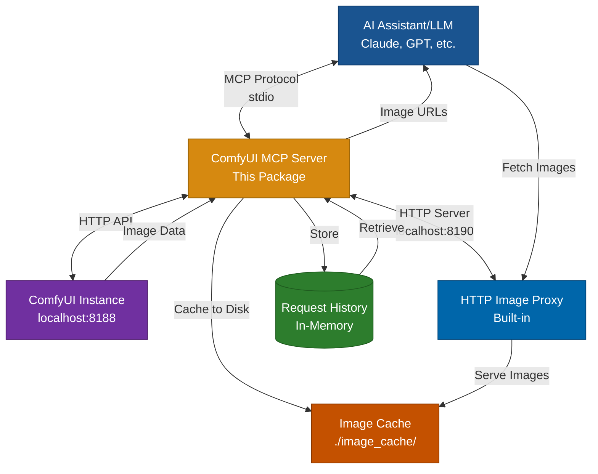

# ComfyUI MCP Server

A Model Context Protocol (MCP) server that enables AI assistants to generate images using a local ComfyUI instance. This server provides seamless integration between MCP-compatible AI tools (like Claude Desktop) and ComfyUI's powerful image generation capabilities.

## Overview

This MCP server exposes four primary tools:
- **`generate_image`**: Queue an image generation task with ComfyUI using a text prompt and optional workflow selection
- **`get_image`**: Retrieve generated images by their prompt ID
- **`get_request_history`**: View history of all image generation requests with current status and workflow used
- **`list_workflows`**: List all available workflow files in your workspace directory

The server communicates with a local ComfyUI instance via its REST API and WebSocket interface, handling workflow execution, queue management, and image retrieval.

### Architecture



**How it works:**
1. Your AI assistant (Claude Desktop, Cline, etc.) sends image generation requests via MCP
2. This server loads your selected workflow (or default), injects parameters, and queues it to ComfyUI
3. Each request is stored in memory with prompt details, dimensions, workflow name, and timestamp
4. ComfyUI generates the image using your local GPU/models
5. The server fetches images from ComfyUI and caches them to disk
6. The server returns HTTP URLs (via built-in proxy server) instead of base64
7. Your AI assistant fetches images directly via HTTP for efficient transfer
8. View request history anytime to recover lost prompt IDs or review past generations

## Features

- 🎨 **Multiple Workflows**: Store and switch between multiple ComfyUI workflows at runtime
- 🗂️ **Workflow Management**: List available workflows and select which one to use for each generation
- 🔄 **Asynchronous Execution**: Queue workflows and retrieve results when ready
- 🎲 **Seed Randomization**: Automatically randomizes seeds for varied batch generation results (configurable)
- 🖼️ **Efficient Image Delivery**: Built-in HTTP proxy server for fast image transfer via URLs (no base64 overhead)
- 💾 **Disk-based Caching**: Images cached locally for quick repeated access
- ⚙️ **Flexible Parameters**: Inject prompt, negative prompt, width, height into your workflows
- 📜 **Request History**: Track all generations with workflow name, prompts, dimensions, and timestamps
- 🔌 **Easy Integration**: Works with any MCP-compatible client via `npx` command
- 📡 **Real-time Updates**: WebSocket support for execution progress tracking

## Prerequisites

- **Node.js**: Version 18.x or higher (LTS recommended)
- **ComfyUI**: Running locally with API access enabled
  - Default: `http://127.0.0.1:8188`
  - Must have a checkpoint model loaded (e.g., SD 1.5, SDXL)

## Installation

1. **Clone the repository**:
```bash
git clone <repository-url>
cd comfyui-mcp
```

2. **Install dependencies**:
```bash
npm install
```

3. **Build the server**:
```bash
npm run build
```

4. **Configure your MCP client** (Claude Desktop, Cline, Cursor, etc.):

Edit your MCP client configuration file and add:

```json
{
  "mcpServers": {
    "comfyui": {
      "command": "node",
      "args": ["/absolute/path/to/comfyui-mcp/dist/index.js"],
      "env": {
        "COMFYUI_URL": "http://127.0.0.1:8188",
        "COMFYUI_WORKFLOW_DIR": "/absolute/path/to/your/workflow_files"
      }
    }
  }
}
```

**Replace**:
- `/absolute/path/to/comfyui-mcp/dist/index.js` with the actual path to your cloned repo
- `/absolute/path/to/your/workflow_files` with the path to your workflow directory

**Config file locations**:
- **Claude Desktop**:
  - macOS: `~/Library/Application Support/Claude/claude_desktop_config.json`
  - Windows: `%APPDATA%\Claude\claude_desktop_config.json`
- **Cline**: `cline_mcp_settings.json` (open via MCP Servers icon in Cline panel)
- **Cursor**: Settings → Composer → Model Context Protocol
- **Other clients**: Refer to your client's MCP configuration documentation

5. **Restart your MCP client**

## Configuration

### Environment Variables

| Variable | Description | Default |
|----------|-------------|---------|
| `COMFYUI_URL` | Base URL of your ComfyUI instance | `http://127.0.0.1:8188` |
| `COMFYUI_WORKFLOW_DIR` | Directory containing your workflow JSON files | `<repo_root>/workflow_files` (relative to `dist/index.js`) |
| `COMFYUI_MCP_HTTP_PORT` | Port for the built-in HTTP image proxy server | `8190` |
| `COMFYUI_IMAGE_CACHE_DIR` | Directory for caching downloaded images | `./image_cache` |
| `COMFYUI_RANDOMIZE_SEEDS` | Enable/disable automatic seed randomization for varied results | `true` (set to `false` to disable) |

### ComfyUI Setup

1. **Start ComfyUI** with API enabled:
   ```bash
   python main.py --listen 127.0.0.1 --port 8188
   ```

2. **Setup Workflow Directory**:
   - Create a directory for your workflow files (e.g., `workflow_files/`)
   - Create your desired workflows in ComfyUI
   - Click "Save (API Format)" to export each as JSON
   - Save at least one workflow as `default_workflow.json` in the directory
   - Add other workflows with descriptive names (e.g., `portrait.json`, `landscape.json`)
   - Set `COMFYUI_WORKFLOW_DIR` to point to this directory

3. **Verify API Access**:
   ```bash
   curl http://127.0.0.1:8188/system_stats
   ```

## Usage

### Tool 1: `list_workflows`

List all available workflow files in your workspace directory. Shows which workflow is set as the default.

**Input Schema:**
```typescript
{
  // No parameters required
}
```

**Response:**
```
Available workflows in /path/to/workflow_files:

- default_workflow.json (default)
- portrait.json
- landscape.json
- anime_style.json

Default workflow: default_workflow.json
```

**Example:**
```
User: What workflows are available?
AI: [Calls list_workflows]
Response: Lists all .json files in the workflow directory
```

### Tool 2: `generate_image`

Generate an image using a ComfyUI workflow with the specified parameters. You can optionally select which workflow to use.

**Input Schema:**
```typescript
{
  prompt: string;           // Text description of the image to generate
  negative_prompt?: string; // Optional: what should NOT be in the image
  width?: number;           // Image width in pixels (default: 512)
  height?: number;          // Image height in pixels (default: 512)
  workflow_name?: string;   // Optional: workflow filename (e.g., "portrait.json")
}
```

**How It Works:**
- The server loads the specified workflow (or `default_workflow.json` if not specified)
- It intelligently finds the appropriate nodes to inject parameters (see "Parameter Injection" below)
- Parameters are injected into the appropriate nodes
- The modified workflow is queued to ComfyUI

**Response:**
```typescript
{
  prompt_id: string;       // Unique ID for this generation request
  number: number;          // Position in the queue
  status: string;          // Current status
}
```

**Example:**
```
User: Generate a portrait using the portrait workflow
AI: [Calls generate_image with prompt="professional headshot portrait", workflow_name="portrait.json", width=768, height=1024]
Response: { prompt_id: "abc123", number: 1, status: "queued" }

User: Generate an image of a mountain landscape (using default workflow)
AI: [Calls generate_image with prompt="serene mountain landscape at sunset", width=1024, height=768]
Response: { prompt_id: "def456", number: 1, status: "queued" }
```

### Tool 3: `get_image`

Retrieve a generated image by its prompt ID.

**Input Schema:**
```typescript
{
  prompt_id: string;       // The prompt_id returned from generate_image
}
```

**Response:**
```typescript
{
  status: string;          // "completed", "executing", "pending", or "not_found"
  images?: [{
    filename: string;      // Image filename
    subfolder: string;     // Subfolder path
    type: string;          // Image type (output/temp)
    url: string;           // HTTP URL to fetch the image
  }];
  queue_position?: number; // Position in queue (if pending)
  queue_size?: number;     // Total items in queue (if pending)
  error?: string;          // Error message if applicable
}
```

**Example:**
```
User: Get the image we just generated
AI: [Calls get_image with prompt_id="abc123"]
Response: {
  status: "completed",
  images: [{
    filename: "ComfyUI_00001_.png",
    subfolder: "",
    type: "output",
    url: "http://localhost:8190/images/abc123/ComfyUI_00001_.png?subfolder=&type=output"
  }]
}
```

**Image Access:**
The image URL points to the built-in HTTP proxy server which:
1. Fetches the image from ComfyUI on first request
2. Caches it to disk in the configured cache directory
3. Serves subsequent requests from cache for fast access
4. Works even if the MCP server is on a different machine than ComfyUI

### Tool 4: `get_request_history`

Retrieve the history of all image generation requests made through this server. Includes workflow name, prompts, dimensions, and current status. Useful for recovering lost prompt IDs or reviewing past generations.

**Input Schema:**
```typescript
{
  // No parameters required
}
```

**Response:**
```typescript
{
  history: [{
    prompt_id: string;           // Unique ID for this request
    prompt: string;              // The positive prompt used
    negative_prompt?: string;    // The negative prompt (if provided)
    width: number;               // Image width
    height: number;              // Image height
    workflow_name: string;       // Name of the workflow file used
    timestamp: string;           // ISO timestamp when request was made
    status: string;              // Current status: "queued", "executing", "completed", "failed"
    queue_position?: number;     // Position in queue when submitted
  }];
  total_requests: number;        // Total number of requests
}
```

**Example:**
```
User: Show me my recent image generation requests
AI: [Calls get_request_history]
Response: {
  history: [
    {
      prompt_id: "abc123",
      prompt: "professional headshot portrait",
      negative_prompt: "blurry, low quality",
      width: 768,
      height: 1024,
      workflow_name: "portrait.json",
      timestamp: "2025-01-15T10:30:00.000Z",
      status: "completed",
      queue_position: 1
    },
    {
      prompt_id: "def456",
      prompt: "serene mountain landscape at sunset",
      width: 1024,
      height: 768,
      workflow_name: "default_workflow.json",
      timestamp: "2025-01-15T10:25:00.000Z",
      status: "completed",
      queue_position: 1
    }
  ],
  total_requests: 2
}
```

**Note:** Request history is stored in memory and will be lost when the server restarts.

## Architecture

This server follows a layered architecture:

1. **MCP Layer**: Handles protocol communication via stdio transport
2. **Tool Layer**: Implements `list_workflows`, `generate_image`, `get_image`, and `get_request_history` tools
3. **HTTP Proxy Layer**: Built-in Express server for efficient image delivery via URLs
4. **Image Cache Layer**: Disk-based caching system for downloaded images
5. **ComfyUI Client Layer**: Manages HTTP/WebSocket communication with ComfyUI
6. **Workflow Loader**: Loads user-provided workflow JSON files from workspace directory and injects parameters


## Workflow Setup

### Creating Workflows

1. **Design in ComfyUI**: Create your workflows with the desired nodes (text-to-image, img2img, etc.)
2. **Export as JSON**: Click "Save (API Format)" - this exports the workflow in the format the API expects
3. **Organize Files**:
   - Create a workflow directory (e.g., `workflow_files/`)
   - Save at least one workflow as `default_workflow.json`
   - Save other workflows with descriptive names (e.g., `portrait.json`, `landscape.json`, `anime.json`)
4. **Configure Directory**: Set `COMFYUI_WORKFLOW_DIR` environment variable to point to your workflow directory

### Switching Between Workflows

When generating images, you can specify which workflow to use:
- **Default workflow**: Omit the `workflow_name` parameter to use `default_workflow.json`
- **Specific workflow**: Pass `workflow_name: "portrait.json"` to use a specific workflow
- **List available**: Use the `list_workflows` tool to see all available workflows

### Parameter Injection

The server uses an intelligent parameter injection strategy to work with a wide variety of ComfyUI workflows:

#### How It Works

1. **Seed Randomization** (enabled by default)
   - Before any other parameter injection, the server scans all nodes in the workflow
   - For any node with a `seed` input parameter, generates a random seed value
   - This ensures different results when batching image generations with identical prompts
   - **Useful for batch generation**: When generating multiple images with the same prompt, you get varied results instead of duplicates
   - Can be disabled by setting `COMFYUI_RANDOMIZE_SEEDS=false` in your environment configuration

2. **Prompt Injection (Positive & Negative)**
   - Finds the `KSampler` node in your workflow
   - Follows the `positive` connection to locate the positive prompt `CLIPTextEncode` node
   - Follows the `negative` connection to locate the negative prompt `CLIPTextEncode` node
   - Injects your `prompt` into the positive node's `text` input
   - Injects your `negative_prompt` (if provided) into the negative node's `text` input
   - **Fallback**: If no KSampler is found, uses the first `CLIPTextEncode` node for the positive prompt

3. **Dimension Injection**
   - Searches for `EmptyLatentImage` (SD1.5/SDXL) or `EmptySD3LatentImage` (SD3) nodes
   - Injects `width` and `height` parameters into the node's inputs

This approach ensures the server correctly identifies positive and negative prompts by following the actual connections in your workflow, rather than guessing based on node order.

#### Example Workflow Structure

Here's how a typical workflow is structured and how parameters are injected:

```json
{
  "3": {
    "class_type": "KSampler",
    "inputs": {
      "positive": ["6", 0],    // ← Server follows this to node "6"
      "negative": ["7", 0],    // ← Server follows this to node "7"
      "latent_image": ["5", 0]
    }
  },
  "6": {
    "class_type": "CLIPTextEncode",
    "inputs": {
      "text": "default positive prompt",  // ← Replaced with your prompt
      "clip": ["4", 1]
    }
  },
  "7": {
    "class_type": "CLIPTextEncode",
    "inputs": {
      "text": "",  // ← Replaced with your negative_prompt (if provided)
      "clip": ["4", 1]
    }
  },
  "5": {
    "class_type": "EmptyLatentImage",
    "inputs": {
      "width": 512,   // ← Replaced with your width
      "height": 512,  // ← Replaced with your height
      "batch_size": 1
    }
  }
}
```

#### Supported Node Types

| Node Type | Purpose | Injected Parameters |
|-----------|---------|-------------------|
| `KSampler` | Sampler node (used to trace connections) | None directly |
| `CLIPTextEncode` | Text prompt encoding | `prompt` or `negative_prompt` via KSampler connections |
| `EmptyLatentImage` | Latent image initialization (SD1.5/SDXL) | `width`, `height` |
| `EmptySD3LatentImage` | Latent image initialization (SD3) | `width`, `height` |

#### Requirements for Your Workflow

For the server to work correctly with your workflow:

1. **Must have**: A `KSampler` node with `positive` and `negative` inputs
2. **Must have**: `CLIPTextEncode` nodes connected to the KSampler's positive/negative inputs
3. **Must have**: An `EmptyLatentImage` or `EmptySD3LatentImage` node for dimension control
4. **Export format**: Use ComfyUI's "Save (API Format)" option to export your workflow

## Development

### Build
```bash
npm run build
```

### Run Locally
```bash
npm start
```

### Run in Development Mode
```bash
npm run dev
```

### Testing with MCP Inspector
```bash
npx @modelcontextprotocol/inspector npm start
```

## API Compatibility

- **MCP Protocol**: 2025-06-18 specification
- **ComfyUI API**: Compatible with ComfyUI v0.1.0+
- **Node.js**: v18.x, v20.x, v22.x (LTS versions)

## Troubleshooting

### ComfyUI Connection Issues
```
Error: Cannot connect to ComfyUI at http://127.0.0.1:8188
```
**Solution**: Ensure ComfyUI is running and accessible. Check the URL and firewall settings.

### Workflow Not Found
```
Error: Workflow file not found: default_workflow.json in /path/to/workflow_files
```
**Solution**: Ensure `default_workflow.json` exists in your `COMFYUI_WORKFLOW_DIR` directory, or specify a valid workflow name using the `workflow_name` parameter.

### Image Generation Timeout
```
Error: Workflow execution timeout
```
**Solution**: Increase timeout in configuration or check ComfyUI logs for execution errors.

### Parameter Injection Failed
```
Error: Could not find suitable node for parameter injection
```
**Solution**: Ensure your workflow has the expected node types (CLIPTextEncode, EmptyLatentImage, etc.). Check the workflow structure matches the injection pattern.

## Security Considerations

- **Local Only**: This server is designed for local ComfyUI instances
- **No Authentication**: ComfyUI API access is unauthenticated by default
- **User Consent**: MCP protocol requires explicit user consent for tool execution
- **Resource Limits**: Consider implementing queue limits for production use

## Limitations

- Requires user to provide workflow JSON files exported from ComfyUI
- Parameter injection relies on standard node types (CLIPTextEncode, EmptyLatentImage, SaveImage)
- Requires ComfyUI instance to be running before server starts
- No built-in retry mechanism for failed generations
- Request history is in-memory only - cleared on server restart

## Future Enhancements

- [ ] Advanced parameter injection for custom node types
- [x] Multiple workflow support with selection mechanism ✅ (Implemented)
- [ ] Progress streaming via MCP notifications
- [ ] Workflow validation and compatibility checking
- [ ] Batch generation support
- [ ] Workflow configuration UI/helper tool
- [ ] Persistent request history with database storage

## Contributing

Contributions welcome! Please:

1. Fork the repository
2. Create a feature branch
3. Make your changes with tests
4. Submit a pull request

## License

MIT License - see LICENSE file for details

## Support

- **MCP Docs**: [modelcontextprotocol.io](https://modelcontextprotocol.io)
- **ComfyUI Docs**: [docs.comfy.org](https://docs.comfy.org)
