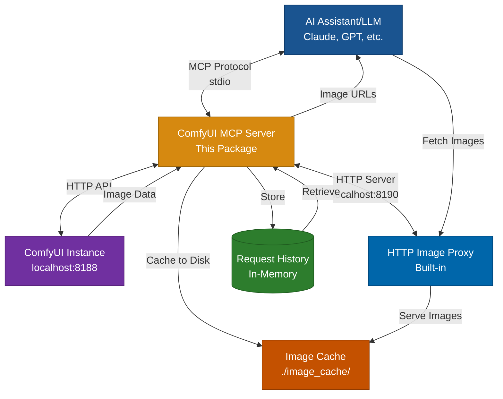

# ComfyUI MCP Server

A Model Context Protocol (MCP) server that enables AI assistants to generate and process images using a local ComfyUI instance. This server provides seamless integration between MCP-compatible AI tools (like Claude Desktop) and ComfyUI's powerful image generation and processing capabilities.

> **📚 New to this project?** Check out the **[Complete Setup Guide](SETUP.md)** for step-by-step instructions on installing ComfyUI, downloading models, and configuring everything from scratch!

## Overview

This MCP server exposes seven powerful tools:

**Image Generation:**
- **`generate_image`**: Generate images from text prompts using any ComfyUI workflow
- **`list_workflows`**: List all available workflow files in your workspace directory

**Image Processing:**
- **`modify_image`**: Transform existing images with AI guidance (img2img)
- **`resize_image`**: Upscale or downscale images with quality preservation
- **`remove_background`**: Remove backgrounds from images, creating transparent cutouts

**Utilities:**
- **`get_image`**: Retrieve generated/processed images by their prompt ID
- **`get_request_history`**: View history of all requests with current status

The server communicates with a local ComfyUI instance via its REST API, handling workflow execution, image uploads, queue management, and image retrieval.

### Architecture



**How it works:**
1. Your AI assistant (Claude Desktop, Cline, etc.) sends image generation requests via MCP
2. This server loads your selected workflow (or default), injects parameters, and queues it to ComfyUI
3. Each request is stored in memory with prompt details, dimensions, workflow name, and timestamp
4. ComfyUI generates the image using your local GPU/models
5. The server fetches images from ComfyUI and caches them to disk
6. The server returns HTTP URLs (via built-in proxy server) instead of base64
7. Your AI assistant fetches images directly via HTTP for efficient transfer
8. View request history anytime to recover lost prompt IDs or review past generations

## Features

**Core Capabilities:**
- 🎨 **Text-to-Image Generation**: Generate images from text descriptions using any ComfyUI workflow
- 🖼️ **Image Modification (img2img)**: Transform existing images with AI-guided prompts
- ⬆️ **Image Upscaling**: High-quality AI upscaling (2x, 4x, 8x) using ComfyUI upscale models
- ⬇️ **Image Resizing**: Simple downscaling to target dimensions
- ✂️ **Background Removal**: Extract subjects from images with transparent backgrounds
- 📤 **Image Upload**: Automatic upload of local images to ComfyUI for processing

**Workflow Management:**
- 🗂️ **Multiple Workflows**: Store and switch between different workflows for various use cases
- 📋 **Workflow Discovery**: List all available workflows in your workspace
- 🔄 **Flexible Workflow Selection**: Choose specific workflows per operation or use defaults

**Performance & Efficiency:**
- ⚡ **Asynchronous Execution**: Queue workflows and retrieve results when ready
- 🎲 **Seed Randomization**: Automatically randomizes seeds for varied batch results (configurable)
- 🖼️ **Efficient Image Delivery**: Built-in HTTP proxy server for fast transfer via URLs (no base64 overhead)
- 💾 **Disk-based Caching**: Images cached locally for instant repeated access

**Smart Parameter Injection:**
- ⚙️ **Text-to-Image**: Inject prompt, negative prompt, width, height
- 🔧 **Image Processing**: Inject image paths, denoise strength, scale factors, upscale models
- 🧠 **Connection-Based**: Intelligently traces workflow node connections for accurate injection

**Tracking & History:**
- 📜 **Request History**: Track all generations/modifications with prompts, dimensions, source images
- 🕐 **Status Tracking**: Real-time status updates for queued, executing, and completed tasks
- 🔍 **Prompt ID Recovery**: Retrieve lost prompt IDs from history

**Integration:**
- 🔌 **Easy Setup**: Works with any MCP-compatible client (Claude Desktop, Cline, Cursor, etc.)
- 🔒 **Local Processing**: All image generation happens on your local GPU with your models
- 🎯 **Type-Safe**: Full TypeScript with runtime validation via Zod

## Prerequisites

- **Node.js**: Version 18.x or higher (LTS recommended)
- **ComfyUI**: Running locally with API access enabled
  - Default: `http://127.0.0.1:8188`
  - Must have at least one Stable Diffusion checkpoint model

## Prerequisites by Feature

Choose what to install based on which features you need:

| Feature | Models Needed | Custom Nodes | Complexity |
|---------|--------------|--------------|------------|
| Text-to-Image | Any SD checkpoint | None | ⭐ Easy |
| Image Modification (img2img) | Any SD checkpoint | None | ⭐ Easy |
| Image Downscaling | None | None | ⭐ Easy |
| Image Upscaling | RealESRGAN models | None | ⭐⭐ Medium |
| Background Removal | Auto-downloaded | rembg OR RMBG | ⭐⭐⭐ Advanced |

**Minimum Setup (Text-to-Image + img2img only):**
- ✅ ComfyUI installed
- ✅ Any Stable Diffusion model (SD 1.5, SDXL, Flux, etc.)
- ✅ Node.js 18+
- No additional downloads needed!

**Full Setup (All Features):**
- ✅ Everything above
- ⬇️ RealESRGAN upscale models (~64MB) - [Download](#image-upscaling-requirements)
- ⬇️ Background removal extension via ComfyUI Manager - [Setup](#background-removal-requirements)

## Model & Extension Requirements

### Core Requirements (All Workflows)

**Base ComfyUI Installation:**
- ComfyUI with API enabled
- At least one Stable Diffusion model (checkpoint)

**Your models should be in:** `ComfyUI/models/checkpoints/` or split models in their respective directories

### Requirements by Workflow Type

#### ✅ Text-to-Image Generation (`generate_image`)

**Models Required:**
- Any Stable Diffusion checkpoint (SD 1.5, SDXL, Flux, etc.) **OR**
- Split models (UNET + CLIP + VAE) like Qwen Image

**For standard SD checkpoints:**
```
ComfyUI/models/checkpoints/
├── sd_xl_base_1.0.safetensors
└── (or any other SD model)
```

**For split models (like Qwen Image in default_workflow.json):**
```
ComfyUI/models/unet/qwen_image_fp8_e4m3fn.safetensors
ComfyUI/models/clip/qwen_2.5_vl_7b_fp8_scaled.safetensors
ComfyUI/models/vae/qwen_image_vae.safetensors
```

**Custom Nodes Required:**
- None (uses built-in ComfyUI nodes)

**Setup Status:** ✅ Ready to use if you have any SD model

---

#### 🖼️ Image Modification (`modify_image`)

**Models Required:**
- Same as text-to-image (any SD checkpoint or split models)

**Custom Nodes Required:**
- None (uses built-in nodes: LoadImage, VAEEncode, KSampler, VAEDecode)

**Setup Status:** ✅ Ready to use if you have any SD model

---

#### ⬇️ Image Downscaling (`resize_image` with method="downscale")

**Models Required:**
- None (uses built-in image processing)

**Custom Nodes Required:**
- None (uses built-in ImageScale node)

**Setup Status:** ✅ Ready to use (no additional setup)

---

#### ⬆️ Image Upscaling (`resize_image` with method="upscale")

**Models Required:**
- **Upscale models** (choose one or more):
  - `RealESRGAN_x4plus.pth` (4x upscale) - **RECOMMENDED**
  - `RealESRGAN_x2plus.pth` (2x upscale)
  - `4x-UltraSharp.pth` (alternative 4x)

**Download from:**
- **RealESRGAN**: https://github.com/xinntao/Real-ESRGAN/releases/tag/v0.1.0
  - Direct link (x4): https://github.com/xinntao/Real-ESRGAN/releases/download/v0.1.0/RealESRGAN_x4plus.pth (64MB)
  - Direct link (x2): https://github.com/xinntao/Real-ESRGAN/releases/download/v0.1.0/RealESRGAN_x2plus.pth (64MB)
- **Other models**: https://openmodeldb.info

**Installation:**
```bash
# Download the .pth file
# Then place in ComfyUI/models/upscale_models/
ComfyUI/
└── models/
    └── upscale_models/
        └── RealESRGAN_x4plus.pth  ← Place here
```

**Verify:**
1. Restart ComfyUI after adding models
2. Models should appear in UpscaleModelLoader node dropdown

**Custom Nodes Required:**
- None (uses built-in UpscaleModelLoader and ImageUpscaleWithModel)

**Setup Status:** ⚠️ Requires model download

---

#### ✂️ Background Removal (`remove_background`)

**Models Required:**
- Downloaded automatically by the extension on first use

**Custom Nodes Required (choose ONE):**

**Option 1: RemBG** (Recommended - Easiest)
- **Extension Name:** ComfyUI rembg
- **Author:** Jcd1230
- **GitHub:** https://github.com/Jcd1230/rembg-comfyui-node
- **Install via:**
  ```
  ComfyUI Manager → Install Custom Nodes → Search "rembg"
  → Install "ComfyUI rembg" by Jcd1230
  → Restart ComfyUI
  ```
- **Models:** Auto-downloaded on first use (~176MB)
- **Node Name:** `Image Remove Background (rembg)`
- **Pros:** Easiest setup, works out of the box
- **Cons:** Single model option

**Option 2: BiRefNet/RMBG** (Best Quality)
- **Extension Name:** ComfyUI-RMBG
- **Author:** 1038lab
- **GitHub:** https://github.com/1038lab/ComfyUI-RMBG
- **Install via:**
  ```
  ComfyUI Manager → Install Custom Nodes → Search "RMBG"
  → Install "ComfyUI-RMBG" by 1038lab
  → Restart ComfyUI
  ```
- **Supported Models:** BiRefNet, RMBG-2.0, InSPyReNet, BEN, BEN2, and more
- **Models:** Auto-downloaded on first use or manual download
- **Pros:** Multiple high-quality models, best results
- **Cons:** More complex setup, larger downloads (300-500MB per model)

**Option 3: Alternative BiRefNet**
- **Extension Name:** ComfyUI-RemoveBackground_SET
- **Author:** set-soft
- **GitHub:** https://github.com/set-soft/ComfyUI-RemoveBackground_SET
- **Supports:** BiRefNet, BRIA, Depth Anything V2, InSPyReNet, etc.

**After Installing Extension:**
1. Models download automatically on first use (or follow extension's README for manual download)
2. Test the node in ComfyUI before using with MCP server
3. If using a different node than RemBG, you may need to update `remove_background_workflow.json` (see workflow_files/README.md)

**Setup Status:** ⚠️ Requires extension installation

---

### Quick Setup Guide

**For Text-to-Image + Image Modification Only:**
```bash
# No additional setup needed!
# Just ensure ComfyUI is running with any SD model
```

**For Image Upscaling:**
```bash
# Download RealESRGAN model
cd ComfyUI/models/upscale_models/
# Download from: https://github.com/xinntao/Real-ESRGAN/releases/download/v0.1.0/RealESRGAN_x4plus.pth
# Restart ComfyUI
```

**For Background Removal:**
```bash
# 1. Open ComfyUI in browser
# 2. Click "Manager" button
# 3. Go to "Install Custom Nodes"
# 4. Search "rembg"
# 5. Install "ComfyUI rembg" by Jcd1230
# 6. Restart ComfyUI
# Models auto-download on first use
```

**For All Features:**
```bash
# 1. Install upscale models (see above)
# 2. Install background removal extension (see above)
# 3. Restart ComfyUI
# 4. Test each workflow in ComfyUI before using with MCP server
```

## Installation

> **💡 First time setup?** See the **[Complete Setup Guide](SETUP.md)** for detailed instructions including ComfyUI installation, model downloads, and troubleshooting.

### Quick Install (MCP Server Only)

1. **Clone the repository**:
```bash
git clone <repository-url>
cd comfyui-mcp
```

2. **Install dependencies**:
```bash
npm install
```

3. **Build the server**:
```bash
npm run build
```

4. **Configure your MCP client** (Claude Desktop, Cline, Cursor, etc.):

Edit your MCP client configuration file and add:

```json
{
  "mcpServers": {
    "comfyui": {
      "command": "node",
      "args": ["/absolute/path/to/comfyui-mcp/dist/index.js"],
      "env": {
        "COMFYUI_URL": "http://127.0.0.1:8188",
        "COMFYUI_WORKFLOW_DIR": "/absolute/path/to/your/workflow_files"
      }
    }
  }
}
```

**Replace**:
- `/absolute/path/to/comfyui-mcp/dist/index.js` with the actual path to your cloned repo
- `/absolute/path/to/your/workflow_files` with the path to your workflow directory

**Config file locations**:
- **Claude Desktop**:
  - macOS: `~/Library/Application Support/Claude/claude_desktop_config.json`
  - Windows: `%APPDATA%\Claude\claude_desktop_config.json`
- **Cline**: `cline_mcp_settings.json` (open via MCP Servers icon in Cline panel)
- **Cursor**: Settings → Composer → Model Context Protocol
- **Other clients**: Refer to your client's MCP configuration documentation

5. **Restart your MCP client**

## Configuration

### Environment Variables

| Variable | Description | Default |
|----------|-------------|---------|
| `COMFYUI_URL` | Base URL of your ComfyUI instance | `http://127.0.0.1:8188` |
| `COMFYUI_WORKFLOW_DIR` | Directory containing your workflow JSON files | `<repo_root>/workflow_files` (relative to `dist/index.js`) |
| `COMFYUI_MCP_HTTP_PORT` | Port for the built-in HTTP image proxy server | `8190` |
| `COMFYUI_IMAGE_CACHE_DIR` | Directory for caching downloaded images | `./image_cache` |
| `COMFYUI_RANDOMIZE_SEEDS` | Enable/disable automatic seed randomization for varied results | `true` (set to `false` to disable) |

### ComfyUI Setup

1. **Start ComfyUI** with API enabled:
   ```bash
   python main.py --listen 127.0.0.1 --port 8188
   ```

2. **Setup Workflow Directory**:
   - Create a directory for your workflow files (e.g., `workflow_files/`)
   - Create your desired workflows in ComfyUI
   - Click "Save (API Format)" to export each as JSON
   - Save at least one workflow as `default_workflow.json` in the directory
   - Add other workflows with descriptive names (e.g., `portrait.json`, `landscape.json`)
   - Set `COMFYUI_WORKFLOW_DIR` to point to this directory

3. **Verify API Access**:
   ```bash
   curl http://127.0.0.1:8188/system_stats
   ```

## Usage

### Tool 1: `list_workflows`

List all available workflow files in your workspace directory. Shows which workflow is set as the default.

**Input Schema:**
```typescript
{
  // No parameters required
}
```

**Response:**
```
Available workflows in /path/to/workflow_files:

- default_workflow.json (default)
- portrait.json
- landscape.json
- anime_style.json

Default workflow: default_workflow.json
```

**Example:**
```
User: What workflows are available?
AI: [Calls list_workflows]
Response: Lists all .json files in the workflow directory
```

### Tool 2: `generate_image`

Generate an image using a ComfyUI workflow with the specified parameters. You can optionally select which workflow to use.

**Input Schema:**
```typescript
{
  prompt: string;           // Text description of the image to generate
  negative_prompt?: string; // Optional: what should NOT be in the image
  width?: number;           // Image width in pixels (default: 512)
  height?: number;          // Image height in pixels (default: 512)
  workflow_name?: string;   // Optional: workflow filename (e.g., "portrait.json")
}
```

**How It Works:**
- The server loads the specified workflow (or `default_workflow.json` if not specified)
- It intelligently finds the appropriate nodes to inject parameters (see "Parameter Injection" below)
- Parameters are injected into the appropriate nodes
- The modified workflow is queued to ComfyUI

**Response:**
```typescript
{
  prompt_id: string;       // Unique ID for this generation request
  number: number;          // Position in the queue
  status: string;          // Current status
}
```

**Example:**
```
User: Generate a portrait using the portrait workflow
AI: [Calls generate_image with prompt="professional headshot portrait", workflow_name="portrait.json", width=768, height=1024]
Response: { prompt_id: "abc123", number: 1, status: "queued" }

User: Generate an image of a mountain landscape (using default workflow)
AI: [Calls generate_image with prompt="serene mountain landscape at sunset", width=1024, height=768]
Response: { prompt_id: "def456", number: 1, status: "queued" }
```

### Tool 3: `get_image`

Retrieve a generated image by its prompt ID.

**Input Schema:**
```typescript
{
  prompt_id: string;       // The prompt_id returned from generate_image
}
```

**Response:**
```typescript
{
  status: string;          // "completed", "executing", "pending", or "not_found"
  images?: [{
    filename: string;      // Image filename
    subfolder: string;     // Subfolder path
    type: string;          // Image type (output/temp)
    url: string;           // HTTP URL to fetch the image
  }];
  queue_position?: number; // Position in queue (if pending)
  queue_size?: number;     // Total items in queue (if pending)
  error?: string;          // Error message if applicable
}
```

**Example:**
```
User: Get the image we just generated
AI: [Calls get_image with prompt_id="abc123"]
Response: {
  status: "completed",
  images: [{
    filename: "ComfyUI_00001_.png",
    subfolder: "",
    type: "output",
    url: "http://localhost:8190/images/abc123/ComfyUI_00001_.png?subfolder=&type=output"
  }]
}
```

**Image Access:**
The image URL points to the built-in HTTP proxy server which:
1. Fetches the image from ComfyUI on first request
2. Caches it to disk in the configured cache directory
3. Serves subsequent requests from cache for fast access
4. Works even if the MCP server is on a different machine than ComfyUI

### Tool 4: `get_request_history`

Retrieve the history of all image generation requests made through this server. Includes workflow name, prompts, dimensions, and current status. Useful for recovering lost prompt IDs or reviewing past generations.

**Input Schema:**
```typescript
{
  // No parameters required
}
```

**Response:**
```typescript
{
  history: [{
    prompt_id: string;           // Unique ID for this request
    prompt: string;              // The positive prompt used
    negative_prompt?: string;    // The negative prompt (if provided)
    width: number;               // Image width
    height: number;              // Image height
    workflow_name: string;       // Name of the workflow file used
    timestamp: string;           // ISO timestamp when request was made
    status: string;              // Current status: "queued", "executing", "completed", "failed"
    queue_position?: number;     // Position in queue when submitted
  }];
  total_requests: number;        // Total number of requests
}
```

**Example:**
```
User: Show me my recent image generation requests
AI: [Calls get_request_history]
Response: {
  history: [
    {
      prompt_id: "abc123",
      prompt: "professional headshot portrait",
      negative_prompt: "blurry, low quality",
      width: 768,
      height: 1024,
      workflow_name: "portrait.json",
      timestamp: "2025-01-15T10:30:00.000Z",
      status: "completed",
      queue_position: 1
    },
    {
      prompt_id: "def456",
      prompt: "serene mountain landscape at sunset",
      width: 1024,
      height: 768,
      workflow_name: "default_workflow.json",
      timestamp: "2025-01-15T10:25:00.000Z",
      status: "completed",
      queue_position: 1
    }
  ],
  total_requests: 2
}
```

**Note:** Request history is stored in memory and will be lost when the server restarts.

### Tool 5: `modify_image`

Transform an existing image using AI-guided modification (img2img). Takes a source image and generates a new version based on your prompt, with control over how much the image changes.

**Input Schema:**
```typescript
{
  image_path: string;           // Absolute path to source image file
  prompt: string;               // Description of desired transformation
  negative_prompt?: string;     // Optional: what to avoid in transformation
  denoise_strength?: number;    // How much to change (0.0-1.0, default: 0.75)
  width?: number;               // Optional: output width in pixels
  height?: number;              // Optional: output height in pixels
  workflow_name?: string;       // Optional: workflow file (default: img2img_workflow.json)
}
```

**Denoise Strength Guide:**
- `0.0-0.3`: Very subtle changes, preserves most of the original
- `0.4-0.6`: Moderate changes, balanced between original and new
- `0.7-0.9`: Significant changes, mostly new interpretation
- `1.0`: Complete reimagining, minimal resemblance to original

**Response:**
```typescript
{
  prompt_id: string;           // Unique ID for this request
  number: number;              // Position in queue
  status: string;              // "queued"
}
```

**Example:**
```
User: Transform this photo of a cat into a watercolor painting
AI: [Calls modify_image with
     image_path="C:/Users/me/photos/cat.jpg",
     prompt="watercolor painting of a cat",
     denoise_strength=0.7]
Response: { prompt_id: "xyz789", number: 1, status: "queued" }

User: Make this portrait look professional
AI: [Calls modify_image with
     image_path="C:/Users/me/photos/portrait.jpg",
     prompt="professional studio portrait, enhanced lighting",
     negative_prompt="amateur, poor lighting",
     denoise_strength=0.5]
Response: { prompt_id: "abc987", number: 1, status: "queued" }
```

**Workflow Requirements:**
Your `img2img_workflow.json` must include:
- `LoadImage` node (for input image)
- `VAEEncode` node (to encode image to latent space)
- `KSampler` node (for generation with denoise control)
- `VAEDecode` and `SaveImage` nodes (for output)

### Tool 6: `resize_image`

Resize or upscale images with quality preservation. Supports both high-quality AI upscaling and simple downscaling.

**Input Schema:**
```typescript
{
  image_path: string;           // Absolute path to source image file
  method: "upscale" | "downscale";  // Resize method
  scale_factor?: number;        // Multiplier (e.g., 2.0 = 2x, 4.0 = 4x)
  target_width?: number;        // Target width (for downscale)
  target_height?: number;       // Target height (for downscale)
  workflow_name?: string;       // Optional: custom workflow
}
```

**Method Requirements:**
- **Upscale**: Requires `scale_factor` (uses AI upscaling models)
- **Downscale**: Requires either `scale_factor` OR `(target_width AND target_height)`

**Response:**
```typescript
{
  prompt_id: string;           // Unique ID for this request
  number: number;              // Position in queue
  status: string;              // "queued"
}
```

**Examples:**
```
User: Upscale this image to 4x resolution
AI: [Calls resize_image with
     image_path="C:/Users/me/images/small.jpg",
     method="upscale",
     scale_factor=4.0]
Response: { prompt_id: "def654", number: 1, status: "queued" }

User: Resize this image to 512x512
AI: [Calls resize_image with
     image_path="C:/Users/me/images/large.png",
     method="downscale",
     target_width=512,
     target_height=512]
Response: { prompt_id: "ghi321", number: 1, status: "queued" }

User: Downscale this to half size
AI: [Calls resize_image with
     image_path="C:/Users/me/images/huge.jpg",
     method="downscale",
     scale_factor=0.5]
Response: { prompt_id: "jkl987", number: 1, status: "queued" }
```

**Workflow Requirements:**

For upscaling (`upscale_workflow.json`):
- `LoadImage` node
- `UpscaleModelLoader` node (requires upscale models like RealESRGAN, etc.)
- Upscaling nodes (e.g., `UltimateSDUpscale`, `ImageUpscaleWithModel`)
- `SaveImage` node

For downscaling (`resize_workflow.json`):
- `LoadImage` node
- `ImageScale` or `ImageScaleBy` node
- `SaveImage` node

### Tool 7: `remove_background`

Remove the background from an image, creating a transparent PNG with only the subject. Perfect for product photos, profile pictures, and cutouts.

**Input Schema:**
```typescript
{
  image_path: string;           // Absolute path to source image file
  workflow_name?: string;       // Optional: workflow file (default: remove_background_workflow.json)
}
```

**Response:**
```typescript
{
  prompt_id: string;           // Unique ID for this request
  number: number;              // Position in queue
  status: string;              // "queued"
}
```

**Examples:**
```
User: Remove the background from this product photo
AI: [Calls remove_background with
     image_path="C:/Users/me/products/shoe.jpg"]
Response: { prompt_id: "mno456", number: 1, status: "queued" }

User: Create a cutout of this person
AI: [Calls remove_background with
     image_path="C:/Users/me/photos/person.png"]
Response: { prompt_id: "pqr123", number: 1, status: "queued" }
```

**Workflow Requirements:**
Your `remove_background_workflow.json` must include:
- `LoadImage` node
- Background removal nodes (e.g., `BiRefNet`, `RemBG`, `BRIA RMBG`, etc.)
- `SaveImage` node (configured to save as PNG with transparency)

**Note:** Requires background removal models installed in ComfyUI (e.g., BiRefNet, RemBG).

### Image Path Requirements

All image processing tools require **absolute file paths**:
- ✅ Windows: `C:\Users\username\Pictures\image.jpg`
- ✅ macOS/Linux: `/Users/username/Pictures/image.jpg`
- ❌ Relative: `./images/photo.jpg` (not supported)

**Supported formats:** PNG, JPG, JPEG, WEBP, GIF, BMP

## Architecture

This server follows a layered architecture:

1. **MCP Layer**: Handles protocol communication via stdio transport
2. **Tool Layer**: Implements image generation (`generate_image`), image processing (`modify_image`, `resize_image`, `remove_background`), and utility tools (`get_image`, `get_request_history`, `list_workflows`)
3. **HTTP Proxy Layer**: Built-in Express server for efficient image delivery via URLs
4. **Image Cache Layer**: Disk-based caching system for downloaded images
5. **ComfyUI Client Layer**: Manages HTTP communication with ComfyUI, including image uploads
6. **Workflow Loader**: Loads user-provided workflow JSON files from workspace directory and intelligently injects parameters


## Workflow Setup

### Quick Start: Required Workflows

To use all features of this MCP server, you'll need these workflow files in your `COMFYUI_WORKFLOW_DIR`:

| Workflow File | Required For | Must Have Nodes |
|---------------|--------------|-----------------|
| `default_workflow.json` | `generate_image` (default) | KSampler, CLIPTextEncode (x2), EmptyLatentImage |
| `img2img_workflow.json` | `modify_image` | LoadImage, VAEEncode, KSampler, VAEDecode |
| `upscale_workflow.json` | `resize_image` (upscale) | LoadImage, UpscaleModelLoader, upscale nodes |
| `resize_workflow.json` | `resize_image` (downscale) | LoadImage, ImageScale/ImageScaleBy |
| `remove_background_workflow.json` | `remove_background` | LoadImage, background removal nodes |

### Creating Workflows

#### General Steps

1. **Design in ComfyUI**: Create your workflow with the required nodes
2. **Test the workflow**: Run it manually in ComfyUI to ensure it works
3. **Export as JSON**: Click "Save (API Format)" - this exports the workflow in the format the API expects
4. **Name appropriately**: Save with the expected filename (e.g., `img2img_workflow.json`)
5. **Place in directory**: Put the file in your `COMFYUI_WORKFLOW_DIR`

#### Workflow Creation Guides

<details>
<summary><b>📸 Creating an img2img Workflow</b></summary>

**Required nodes:**
1. `LoadImage` - Loads the uploaded image
2. `VAEEncode` - Converts image to latent space
3. `KSampler` - Generates with denoise control
4. `CLIPTextEncode` (x2) - For positive and negative prompts
5. `VAEDecode` - Converts latent back to image
6. `SaveImage` - Saves the result

**Example workflow structure:**
```
LoadImage → VAEEncode → KSampler → VAEDecode → SaveImage
                            ↑
                     CLIPTextEncode (positive)
                     CLIPTextEncode (negative)
```

**Tips:**
- Set denoise to 0.75 in the workflow (will be overridden by parameter)
- Use the same checkpoint/VAE as your text-to-image workflows
- Test with various denoise values (0.3-0.9) to see effects
</details>

<details>
<summary><b>⬆️ Creating an Upscale Workflow</b></summary>

**Required models:** Install upscale models in `ComfyUI/models/upscale_models/`
- RealESRGAN_x4plus.pth (recommended)
- Or other upscale models (ESRGAN, etc.)

**Required nodes:**
1. `LoadImage` - Loads the uploaded image
2. `UpscaleModelLoader` - Loads the upscale model
3. Upscale nodes (choose one approach):
   - **Simple**: `ImageUpscaleWithModel` → direct upscaling
   - **Advanced**: `UltimateSDUpscale` → iterative upscaling with SD
4. `SaveImage` - Saves the result

**Example simple workflow:**
```
LoadImage → ImageUpscaleWithModel → SaveImage
                ↑
         UpscaleModelLoader
```

**Tips:**
- For 4x upscaling, use RealESRGAN_x4plus
- For 2x upscaling, use RealESRGAN_x2plus or similar
- Advanced workflows can use SD to enhance details during upscaling
</details>

<details>
<summary><b>⬇️ Creating a Resize/Downscale Workflow</b></summary>

**Required nodes:**
1. `LoadImage` - Loads the uploaded image
2. `ImageScale` or `ImageScaleBy` - Resizes the image
3. `SaveImage` - Saves the result

**Example workflow:**
```
LoadImage → ImageScale → SaveImage
```

**Tips:**
- `ImageScale` uses absolute dimensions (width, height)
- `ImageScaleBy` uses scale factor (0.5 = half size)
- Set interpolation mode to "lanczos" or "bicubic" for best quality
- This is fast and doesn't require models
</details>

<details>
<summary><b>✂️ Creating a Background Removal Workflow</b></summary>

**Required models:** Install background removal models via ComfyUI Manager
- **BiRefNet** (recommended) - Install via ComfyUI Manager
- **RemBG** - Alternative option
- **BRIA RMBG** - Another alternative

**Required nodes:**
1. `LoadImage` - Loads the uploaded image
2. Background removal node (e.g., `BiRefNet-Matting`, `RemBG Remove Background`)
3. `SaveImage` - Saves the result as PNG

**Example workflow with BiRefNet:**
```
LoadImage → BiRefNet-Matting → SaveImage
```

**Example workflow with RemBG:**
```
LoadImage → RemBG Remove Background → SaveImage
```

**Tips:**
- Configure `SaveImage` to save as PNG (for transparency support)
- BiRefNet typically gives best results for general use
- Test with different models to see which works best for your images
- Some nodes have parameters for fine-tuning edge detection
</details>

### Switching Between Workflows

When using tools, you can specify which workflow to use:
- **Default workflow**: Omit the `workflow_name` parameter to use the default for that tool
- **Specific workflow**: Pass `workflow_name: "my_custom.json"` to use a specific workflow
- **List available**: Use the `list_workflows` tool to see all available workflows

**Default workflow mapping:**
- `generate_image` → `default_workflow.json`
- `modify_image` → `img2img_workflow.json`
- `resize_image` (upscale) → `upscale_workflow.json`
- `resize_image` (downscale) → `resize_workflow.json`
- `remove_background` → `remove_background_workflow.json`

### Parameter Injection

The server uses an intelligent parameter injection strategy to work with a wide variety of ComfyUI workflows:

#### How It Works

1. **Seed Randomization** (enabled by default)
   - Before any other parameter injection, the server scans all nodes in the workflow
   - For any node with a `seed` input parameter, generates a random seed value
   - This ensures different results when batching image generations with identical prompts
   - **Useful for batch generation**: When generating multiple images with the same prompt, you get varied results instead of duplicates
   - Can be disabled by setting `COMFYUI_RANDOMIZE_SEEDS=false` in your environment configuration

2. **Prompt Injection** (for text-to-image and img2img)
   - Finds the `KSampler` node in your workflow
   - Follows the `positive` connection to locate the positive prompt `CLIPTextEncode` node
   - Follows the `negative` connection to locate the negative prompt `CLIPTextEncode` node
   - Injects your `prompt` into the positive node's `text` input
   - Injects your `negative_prompt` (if provided) into the negative node's `text` input
   - **Fallback**: If no KSampler is found, uses the first `CLIPTextEncode` node for the positive prompt

3. **Dimension Injection** (for text-to-image)
   - Searches for `EmptyLatentImage` (SD1.5/SDXL) or `EmptySD3LatentImage` (SD3) nodes
   - Injects `width` and `height` parameters into the node's inputs

4. **Input Image Injection** (for img2img, resize, background removal)
   - Finds the `LoadImage` node in your workflow
   - Injects the uploaded filename into the node's `image` input

5. **Denoise Strength Injection** (for img2img)
   - Finds the `KSampler` node
   - Injects `denoise_strength` (0.0-1.0) into the node's `denoise` parameter
   - Controls how much the image changes vs. stays the same

6. **Scale Factor Injection** (for resizing)
   - Finds `ImageScale` or `ImageScaleBy` node
   - For `ImageScaleBy`: injects `scale_factor` directly
   - For `ImageScale`: calculates target dimensions from scale factor

7. **Upscale Method Injection** (for upscaling)
   - Finds `UpscaleModelLoader` node
   - Injects model name (e.g., "RealESRGAN_x4plus.pth")

This approach ensures the server correctly identifies nodes by following the actual connections in your workflow, rather than guessing based on node order.

#### Example Workflow Structure

Here's how a typical workflow is structured and how parameters are injected:

```json
{
  "3": {
    "class_type": "KSampler",
    "inputs": {
      "positive": ["6", 0],    // ← Server follows this to node "6"
      "negative": ["7", 0],    // ← Server follows this to node "7"
      "latent_image": ["5", 0]
    }
  },
  "6": {
    "class_type": "CLIPTextEncode",
    "inputs": {
      "text": "default positive prompt",  // ← Replaced with your prompt
      "clip": ["4", 1]
    }
  },
  "7": {
    "class_type": "CLIPTextEncode",
    "inputs": {
      "text": "",  // ← Replaced with your negative_prompt (if provided)
      "clip": ["4", 1]
    }
  },
  "5": {
    "class_type": "EmptyLatentImage",
    "inputs": {
      "width": 512,   // ← Replaced with your width
      "height": 512,  // ← Replaced with your height
      "batch_size": 1
    }
  }
}
```

#### Supported Node Types

| Node Type | Purpose | Injected Parameters |
|-----------|---------|-------------------|
| `KSampler` | Sampler node (used to trace connections) | `denoise` (for img2img) |
| `CLIPTextEncode` | Text prompt encoding | `prompt` or `negative_prompt` via KSampler connections |
| `EmptyLatentImage` | Latent image initialization (SD1.5/SDXL) | `width`, `height` |
| `EmptySD3LatentImage` | Latent image initialization (SD3) | `width`, `height` |
| `LoadImage` | Image input for processing | `image` (uploaded filename) |
| `ImageScale` | Resize to absolute dimensions | `width`, `height` (calculated from scale_factor) |
| `ImageScaleBy` | Resize by scale factor | `scale_by` |
| `UpscaleModelLoader` | Load upscale model | `model_name` |

#### Requirements for Your Workflows

Different tools have different requirements:

**Text-to-Image** (`generate_image`):
1. `KSampler` node with `positive` and `negative` inputs
2. `CLIPTextEncode` nodes connected to the KSampler's positive/negative inputs
3. `EmptyLatentImage` or `EmptySD3LatentImage` node for dimension control
4. Export format: Use ComfyUI's "Save (API Format)" option

**img2img** (`modify_image`):
1. `LoadImage` node for input image
2. `VAEEncode` to convert to latent space
3. `KSampler` with `positive`, `negative`, and `denoise` parameters
4. `CLIPTextEncode` nodes for prompts
5. `VAEDecode` and `SaveImage` for output

**Upscaling** (`resize_image` with method="upscale"):
1. `LoadImage` node for input image
2. `UpscaleModelLoader` with upscale models installed
3. Upscale nodes (e.g., `ImageUpscaleWithModel`)
4. `SaveImage` for output

**Resizing** (`resize_image` with method="downscale"):
1. `LoadImage` node for input image
2. `ImageScale` or `ImageScaleBy` node
3. `SaveImage` for output

**Background Removal** (`remove_background`):
1. `LoadImage` node for input image
2. Background removal nodes (BiRefNet, RemBG, etc.)
3. `SaveImage` configured for PNG output with transparency

## Development

### Build
```bash
npm run build
```

### Run Locally
```bash
npm start
```

### Run in Development Mode
```bash
npm run dev
```

### Testing with MCP Inspector
```bash
npx @modelcontextprotocol/inspector npm start
```

## API Compatibility

- **MCP Protocol**: 2025-06-18 specification
- **ComfyUI API**: Compatible with ComfyUI v0.1.0+
- **Node.js**: v18.x, v20.x, v22.x (LTS versions)

## Troubleshooting

### ComfyUI Connection Issues
```
Error: Cannot connect to ComfyUI at http://127.0.0.1:8188
```
**Solution**: Ensure ComfyUI is running and accessible. Check the URL and firewall settings.

### Workflow Not Found
```
Error: Workflow file not found: default_workflow.json in /path/to/workflow_files
```
**Solution**: Ensure `default_workflow.json` exists in your `COMFYUI_WORKFLOW_DIR` directory, or specify a valid workflow name using the `workflow_name` parameter.

### Image Generation Timeout
```
Error: Workflow execution timeout
```
**Solution**: Increase timeout in configuration or check ComfyUI logs for execution errors.

### Parameter Injection Failed
```
Error: Could not find suitable node for parameter injection
```
**Solution**: Ensure your workflow has the expected node types (CLIPTextEncode, EmptyLatentImage, etc.). Check the workflow structure matches the injection pattern.

## Security Considerations

- **Local Only**: This server is designed for local ComfyUI instances
- **No Authentication**: ComfyUI API access is unauthenticated by default
- **User Consent**: MCP protocol requires explicit user consent for tool execution
- **Resource Limits**: Consider implementing queue limits for production use

## Limitations

- Requires user to provide workflow JSON files exported from ComfyUI
- Parameter injection relies on standard node types (see "Supported Node Types" table)
- Requires ComfyUI instance to be running before server starts
- No built-in retry mechanism for failed generations
- Request history is in-memory only - cleared on server restart
- Image upload requires absolute file paths (relative paths not supported)
- Background removal and upscaling require appropriate models installed in ComfyUI

## Future Enhancements

- [ ] Advanced parameter injection for custom node types
- [x] Multiple workflow support with selection mechanism ✅ (Implemented)
- [x] Image upload and processing (img2img, upscale, resize, background removal) ✅ (Implemented)
- [ ] Progress streaming via MCP notifications
- [ ] Workflow validation and compatibility checking
- [ ] Batch image processing (multiple images at once)
- [ ] Workflow configuration UI/helper tool
- [ ] Persistent request history with database storage
- [ ] Support for ControlNet and IP-Adapter workflows
- [ ] Inpainting with mask support
- [ ] Video processing capabilities

## Contributing

Contributions welcome! Please:

1. Fork the repository
2. Create a feature branch
3. Make your changes with tests
4. Submit a pull request

## License

MIT License - see LICENSE file for details

## Support

- **MCP Docs**: [modelcontextprotocol.io](https://modelcontextprotocol.io)
- **ComfyUI Docs**: [docs.comfy.org](https://docs.comfy.org)
