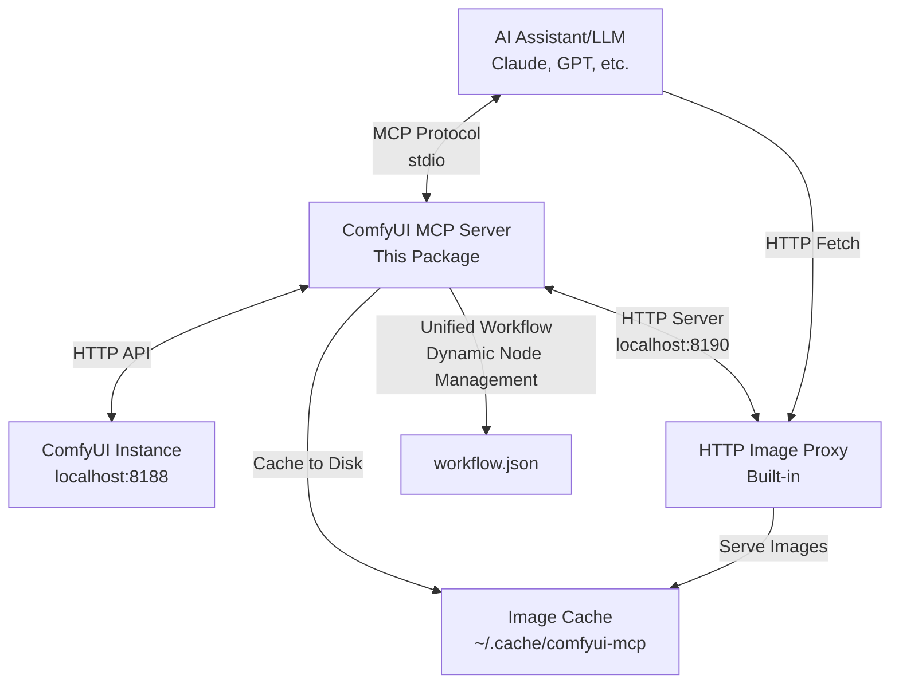

# ComfyUI MCP Server
[](https://ko-fi.com/T6T61NJXQS)

A Model Context Protocol (MCP) server that enables AI assistants to generate and process images using a local ComfyUI instance. This server provides seamless integration between MCP-compatible AI tools (like Claude Desktop) and ComfyUI's powerful image generation and processing capabilities.

> **📚 New to this project?** Check out the **[Complete Setup Guide](SETUP.md)** for step-by-step instructions installing ComfyUI, downloading models, and configuring everything from scratch!

## Overview

This MCP server exposes **four tools** with a unified architecture:

**Image Generation & Processing:**
- **`comfyui_generate_image`**: Unified tool supporting three modes (txt2img, img2img, post-process) with dynamic workflow node management and optional LoRA stacking (1–4 LoRAs). Returns immediately with a `prompt_id` by default; set `wait: true` to block until the image is ready.
- **`comfyui_get_image`**: Retrieve generated/processed images by their prompt ID — use to poll for completion after a non-blocking `generate_image` call

**Utilities:**
- **`comfyui_get_request_history`**: View history of all requests with current status
- **`comfyui_list_loras`**: List available LoRA filenames on the ComfyUI server (reads the `LoraLoader` enum)

The server communicates with a local ComfyUI instance via its REST API, handling workflow execution, image uploads, queue management, and image retrieval.

### Architecture


```mermaid
graph TB
    A[AI Assistant/LLM<br/>Claude, GPT, etc.] <-->|MCP Protocol<br/>stdio| B[ComfyUI MCP Server<br/>This Package]
    B <-->|HTTP API| C[ComfyUI Instance<br/>localhost:8188]
    B -->|Cache to Disk| E[Image Cache<br/>~/.cache/comfyui-mcp]
    B <-->|HTTP Server<br/>localhost:8190| F[HTTP Image Proxy<br/>Built-in]
    F -->|Serve Images| E
    A -->|HTTP Fetch| F
    B -->|Unified Workflow<br/>Dynamic Node Management| G[workflow.json]
```

**How it works:**
1. Your AI assistant (Claude Desktop, Cline, etc.) sends an image generation request via MCP
2. The server loads the unified workflow.json and **dynamically removes/rewires nodes** based on the requested mode
3. Each request is stored in memory with prompt details, dimensions, mode, and timestamp
4. By default the tool returns immediately with a `prompt_id`; the agent polls `comfyui_get_image` for completion. Pass `wait: true` to block until the image is ready and get URLs back directly.
5. The server returns HTTP URLs (via built-in proxy server) instead of base64; your AI assistant fetches images directly via HTTP for efficient transfer
6. View request history anytime to recover lost prompt IDs or review past generations

## Features

**Core Capabilities:**
- 🎨 **Text-to-Image Generation**: Generate images from text descriptions using the unified workflow
- 🖼️ **Image Modification (img2img)**: Transform existing images with AI-guided prompts
- ✂️ **Post-Processing**: Resize and/or remove backgrounds from images
- 📤 **Automatic Image Upload**: Seamless upload of local images to ComfyUI for processing
- 🔄 **Dynamic Node Management**: Single workflow file with nodes automatically enabled/disabled based on mode

**Unified Workflow Architecture:**
- 📋 **Single Workflow File**: One `workflow.json` containing all possible nodes
- ⚙️ **Dynamic Node Removal**: Unused nodes automatically removed before execution
- 🔌 **Automatic Rewiring**: Connections reconfigured based on selected mode
- 📐 **Aspect-Ratio-Aware Generation**: For txt2img with dimensions, generates at ~1M pixels then resizes

**Efficient Image Delivery:**
- ⏱️ **Blocking or Non-Blocking**: Default returns immediately with a `prompt_id` (agent polls `comfyui_get_image`); pass `wait: true` to block until the image is ready and get URLs directly
- 🎲 **Seed Randomization**: Automatically randomizes seeds for varied batch results (configurable)
- 🖼️ **Efficient Image Delivery**: Built-in HTTP proxy server for fast transfer via URLs (no base64 overhead)
- 💾 **Disk-based Caching**: Images cached locally for instant repeated access

**Smart Parameter Injection:**
- ⚙️ **Text-to-Image**: Inject prompt, negative prompt, width, height with aspect-ratio-aware generation
- 🔧 **Image Processing**: Inject image paths, resize dimensions, background removal
- 🧠 **Connection-Based Tracing**: Intelligently traces workflow node connections for accurate injection

**Tracking & History:**
- 📜 **Request History**: Track all generations with prompts, dimensions, mode, source images
- 🕐 **Status Tracking**: Real-time status updates for queued, executing, and completed tasks
- 🔍 **Prompt ID Recovery**: Retrieve lost prompt IDs from history

**Integration:**
- 🔌 **Easy Setup**: Works with any MCP-compatible client (Claude Desktop, Cline, Cursor, etc.)
- 🔒 **Local Processing**: All image generation happens on your local GPU with your models
- 🎯 **Type-Safe**: Full TypeScript with runtime validation via Zod

## Unified Tool: `comfyui_generate_image`

The server now uses a **single unified tool** with three auto-detected modes:

| Mode | prompt | image_path | Description |
|------|--------|------------|-------------|
| **txt2img** | ✅ | ❌ | Generate image from text prompt |
| **img2img** | ✅ | ✅ | Modify existing image guided by prompt |
| **post-process** | ❌ | ✅ | Resize and/or remove background only |

### Parameters

| Parameter | Type | Required? | Mode | Description |
|-----------|------|-----------|------|-------------|
| `prompt` | string | No (at least one of prompt/image_path) | txt2img, img2img | Text description of desired image |
| `negative_prompt` | string | No | txt2img, img2img | What to avoid in the image |
| `image_path` | string | No (at least one of prompt/image_path) | img2img, post-process | Absolute path to input image |
| `width` | number | No | All modes | Target output width in pixels |
| `height` | number | No | All modes | Target output height in pixels |
| `remove_background` | boolean | No | All modes | Remove background from output (default: false) |
| `loras` | array | No | txt2img, img2img | LoRA stack (max 4). Each entry: `{ name, strength_model (-2..2, default 1.0), strength_clip? }`. Omit to use `COMFYUI_DEFAULT_LORAS`; pass `[]` to disable defaults. Use `comfyui_list_loras` to discover filenames. |
| `wait` | boolean | No | All modes | Block until image is ready and return URLs directly (default: false) |

### txt2img Mode

Generate an image from a text prompt.

**Example:**
```typescript
{
  prompt: "A serene mountain landscape at sunset with golden hour lighting"
}
```

**With custom dimensions:**
```typescript
{
  prompt: "Professional headshot of a business person",
  width: 1920,
  height: 1080
}
```

**With background removal:**
```typescript
{
  prompt: "A cute cat sitting on a windowsill",
  width: 1024,
  height: 1024,
  remove_background: true
}
```

**With a LoRA stack:**
```typescript
{
  prompt: "a red pixel cube on a black backdrop",
  loras: [
    { name: "PixelArtV3Flux.safetensors", strength_model: 0.9 }
  ]
}
```

LoRAs chain serially between the UNet/CLIP loaders and every downstream
consumer. Drop `.safetensors` files into `<ComfyUI>/models/loras/` and call
`comfyui_list_loras` to discover filenames. See SETUP.md → "Installing
LoRAs" for sourcing guidance and Klein compatibility notes. LoRAs are
ignored in post-process mode (no generation pipeline present).

### img2img Mode

Transform an existing image using AI guidance.

The Flux 2 Klein edit workflow preserves character/subject identity natively
(via ReferenceLatent + CFGGuider), so there is no denoise knob to tune.

**Example:**
```typescript
{
  prompt: "Transform into watercolor painting style",
  image_path: "/home/user/photos/cat.jpg"
}
```

**With custom dimensions:**
```typescript
{
  prompt: "Make this portrait look more professional",
  image_path: "/home/user/photos/portrait.jpg",
  width: 1024,
  height: 1024
}
```

**With background removal:**
```typescript
{
  image_path: "/home/user/products/shoe.jpg",
  remove_background: true
}
```

### Post-Processing Mode

Only post-process an existing image (resize/remove background, no generation).

**Resize only:**
```typescript
{
  image_path: "/home/user/images/photo.jpg",
  width: 512,
  height: 512
}
```

**Background removal only:**
```typescript
{
  image_path: "/home/user/photos/person.png",
  remove_background: true
}
```

**Resize + background removal:**
```typescript
{
  image_path: "/home/user/images/image.jpg",
  width: 1024,
  height: 768,
  remove_background: true
}
```

### Aspect Ratio Strategy (txt2img with dimensions)

When `width` and `height` are provided for txt2img:
1. Calculate generation dimensions maintaining aspect ratio at ~1M total pixels
2. Generate at calculated dimensions
3. Resize output to exact target dimensions

**Example:** `1920×1080` → generate at `1344×768` → resize to `1920×1080`

### Response

By default (`wait: false`), `comfyui_generate_image` returns immediately:

```typescript
{
  prompt_id: string;       // Unique ID — pass to comfyui_get_image to poll
  status: 'queued';
  mode: 'txt2img' | 'img2img' | 'post-process';
  queue_position?: number; // Position in the ComfyUI queue
}
```

Use `comfyui_get_image` with the returned `prompt_id` to poll for completion and retrieve image URLs.

With `wait: true`, the tool blocks until the image is ready (or fails/times out) and returns:

```typescript
{
  prompt_id: string;
  status: 'completed';
  mode: 'txt2img' | 'img2img' | 'post-process';
  images: [{
    filename: string;
    subfolder: string;
    type: string;
    url: string;           // HTTP URL to fetch the image
  }];
  duration_ms: number;     // How long generation took
}
```

## Other Tools

### `comfyui_get_image`

Retrieve image URLs for a previously queued generation by its prompt ID. This is the standard way to poll for completion after a non-blocking `comfyui_generate_image` call (the default). Also works for recovering results from older prompt IDs.

**Input Schema:**
```typescript
{
  prompt_id: string;       // The prompt_id returned from generate_image
}
```

**Response:**
```typescript
{
  status: string;          // "completed", "executing", "pending", or "failed"
  images?: [{
    filename: string;      // Image filename
    subfolder: string;     // Subfolder path
    type: string;          // Image type (output/temp)
    url: string;           // HTTP URL to fetch the image
  }];
  queue_position?: number; // Position in queue (if pending)
  queue_size?: number;     // Total items in queue (if pending)
  error?: string;          // Error message if applicable
}
```

**Example:**
```
User: Get the image we just generated
AI: [Calls comfyui_get_image with prompt_id="abc123"]
Response: {
  status: "completed",
  images: [{
    filename: "ComfyUI_00001_.png",
    subfolder: "",
    type: "output",
    url: "http://localhost:8190/images/abc123/ComfyUI_00001_.png?subfolder=&type=output"
  }]
}
```

**Image Access:**
The image URL points to the built-in HTTP proxy server which:
1. Fetches the image from ComfyUI on first request
2. Caches it to disk in the configured cache directory
3. Serves subsequent requests from cache for fast access
4. Works even if the MCP server is on a different machine than ComfyUI

### `comfyui_get_request_history`

Retrieve the history of all image generation requests made through this server. Includes prompts, dimensions, mode, and current status. Useful for recovering lost prompt IDs or reviewing past generations.

**Input Schema:**
```typescript
{
  limit?: number;   // Max entries to return (1–100, default: 50)
  offset?: number;  // Skip this many entries for pagination (default: 0)
}
```

**Response:**
```typescript
{
  history: [{
    prompt_id: string;           // Unique ID for this request
    prompt: string;              // The positive prompt used (if mode is txt2img/img2img)
    negative_prompt?: string;    // The negative prompt (if provided)
    width: number;               // Image width
    height: number;              // Image height
    mode: 'txt2img' | 'img2img' | 'post-process'
    remove_background?: boolean; // If true, background was removed
    timestamp: string;           // ISO timestamp when request was made
    status: string;              // Current status: "queued", "executing", "completed", "failed"
  }];
  total_count: number;           // Total number of requests ever made
  limit: number;                 // Limit used for this page
  offset: number;                // Offset used for this page
  has_more: boolean;             // Whether more entries exist beyond this page
  next_offset: number;           // Offset to use for the next page
}
```

**Example:**
```
User: Show me my recent image generation requests
AI: [Calls comfyui_get_request_history]
Response: {
  history: [
    {
      prompt_id: "abc123",
      prompt: "professional headshot portrait",
      negative_prompt: "blurry, low quality",
      width: 768,
      height: 1024,
      mode: "txt2img",
      timestamp: "2025-01-15T10:30:00.000Z",
      status: "completed"
    },
    {
      prompt_id: "def456",
      prompt: "watercolor painting style",
      image_path: "/home/user/photos/cat.jpg",
      mode: "img2img",
      timestamp: "2025-01-15T10:25:00.000Z",
      status: "completed"
    }
  ],
  total_count: 2,
  limit: 50,
  offset: 0,
  has_more: false,
  next_offset: 50
}
```

**Note:** Request history is stored in memory and will be lost when the server restarts.

## Requirements

### Core Requirements (All Modes)

**Base ComfyUI Installation:**
- ComfyUI with API enabled
- The bundled `workflow_files/workflow.json` is wired for **FLUX.2 [klein] 4B**
  (base variant). You'll need:
  - `flux-2-klein-base-4b.safetensors` in `ComfyUI/models/diffusion_models/`
  - `qwen_3_4b.safetensors` in `ComfyUI/models/text_encoders/`
  - `flux2-vae.safetensors` in `ComfyUI/models/vae/`

The easiest way to provision these is `npm run setup:comfyui -- /path/to/ComfyUI`
from this repo — see the [Complete Setup Guide](SETUP.md) for details.

### Custom Nodes

The unified workflow uses built-in ComfyUI nodes plus one custom node for
background removal:
- LoadImage, VAEEncode, VAEDecode
- KSampler, CLIPTextEncode
- EmptyFlux2LatentImage
- ImageScale (resize)
- SaveImage
- Model loading nodes (UNETLoader, CLIPLoader, VAELoader)
- **RMBG** (from [ComfyUI-RMBG](https://github.com/1038lab/ComfyUI-RMBG)) for
  background removal — installed automatically by `npm run setup:comfyui`

### Background Removal

If you want to use `remove_background: true`, you need a background removal model installed in ComfyUI:

**Option 1: RMBG-2.0** (Default in unified workflow)
- Install via ComfyUI Manager: Search "RMBG"
- GitHub: https://github.com/1038lab/ComfyUI-RMBG
- Models auto-download on first use

**Option 2: RemBG**
- Extension: ComfyUI rembg by Jcd1230
- GitHub: https://github.com/Jcd1230/rembg-comfyui-node

## Installation

> **💡 First time setup?** See the **[Complete Setup Guide](SETUP.md)** for detailed instructions including ComfyUI installation, model downloads, and troubleshooting.

### Quick Install (MCP Server Only)

1. **Clone the repository**:
```bash
git clone <repository-url>
cd comfyui-mcp
```

2. **Install dependencies**:
```bash
npm install
```

3. **Build the server**:
```bash
npm run build
```

4. **(Optional) Provision ComfyUI**: run `npm run setup:comfyui -- /path/to/ComfyUI`
to install `ComfyUI-RMBG` and download the Qwen-Image model files the bundled
workflow needs. Idempotent — skip files/nodes already present.

5. **Configure your MCP client** (Claude Desktop, Cline, Cursor, etc.):

Edit your MCP client configuration file and add:

```json
{
  "mcpServers": {
    "comfyui": {
      "command": "node",
      "args": ["/absolute/path/to/comfyui-mcp/dist/index.js"],
      "env": {
        "COMFYUI_URL": "http://127.0.0.1:8188",
        "COMFYUI_WORKFLOW_DIR": "/absolute/path/to/your/workflow_files"
      }
    }
  }
}
```

**Replace**:
- `/absolute/path/to/comfyui-mcp/dist/index.js` with the actual path to your cloned repo
- `/absolute/path/to/your/workflow_files` with the path to your workflow directory

**Config file locations**:
- **Claude Desktop**:
  - macOS: `~/Library/Application Support/Claude/claude_desktop_config.json`
  - Windows: `%APPDATA%\Claude\claude_desktop_config.json`
- **Cline**: `cline_mcp_settings.json` (open via MCP Servers icon in Cline panel)
- **Cursor**: Settings → Composer → Model Context Protocol
- **Other clients**: Refer to your client's MCP configuration documentation

6. **Restart your MCP client**

## Configuration

### Environment Variables

| Variable | Description | Default |
|----------|-------------|---------|
| `COMFYUI_URL` | Base URL of your ComfyUI instance | `http://127.0.0.1:8188` |
| `COMFYUI_WORKFLOW_DIR` | Directory containing workflow.json | `<repo_root>/workflow_files` (relative to `dist/index.js`) |
| `COMFYUI_MCP_HTTP_PORT` | Port for the built-in HTTP image proxy server | `8190` |
| `COMFYUI_IMAGE_CACHE_DIR` | Directory for caching downloaded images | `~/.cache/comfyui-mcp` |
| `COMFYUI_RANDOMIZE_SEEDS` | Enable/disable automatic seed randomization for varied results | `true` (set to `false` to disable) |
| `COMFYUI_POLL_INTERVAL_MS` | Interval (ms) between ComfyUI completion checks while blocking in `wait: true` mode | `2000` |
| `COMFYUI_DEFAULT_LORAS` | Comma-separated `name:strength` pairs applied when a request omits `loras` (e.g. `pixel-art-flux.safetensors:0.8`). Pass `loras: []` in a request to override. | *(none)* |

### ComfyUI Setup

1. **Start ComfyUI** with API enabled:
```bash
python main.py --listen 127.0.0.1 --port 8188
```

2. **Setup Workflow Directory**:
- Create a directory for your workflow files (e.g., `workflow_files/`)
- Create your desired workflow in ComfyUI
- Click "Save (API Format)" to export as JSON
- Save as `workflow.json` in the directory
- The unified workflow includes all nodes for all modes

3. **Verify API Access**:
```bash
curl http://127.0.0.1:8188/system_stats
```

## Usage Examples

### Example 1: Basic Text-to-Image

Generate a simple image with default settings (1024×1024):

```typescript
{
  prompt: "A beautiful sunset over mountains"
}
```

### Example 2: Text-to-Image with Custom Dimensions

Generate at specific dimensions with aspect-ratio-aware generation:

```typescript
{
  prompt: "Professional headshot of a business person in a modern office",
  width: 1920,
  height: 1080
}
```

This will:
1. Calculate generation dimensions (~1M pixels total) maintaining aspect ratio
2. Generate at calculated dimensions (e.g., 1344×768)
3. Resize output to exact 1920×1080

### Example 3: Text-to-Image with Background Removal

Generate and remove background in one call:

```typescript
{
  prompt: "A cute tabby cat sitting on a windowsill, Pixar style",
  width: 1024,
  height: 1024,
  remove_background: true
}
```

### Example 4: Image-to-Image Transformation

Transform an existing photo using AI:

```typescript
{
  prompt: "Transform into a watercolor painting with soft edges",
  image_path: "/home/user/photos/landscape.jpg"
}
```

The Flux 2 Klein edit workflow preserves subject identity natively — no
denoise slider required.

### Example 5: Image-to-Image with Custom Dimensions

Transform and resize in one call:

```typescript
{
  prompt: "Make this photo look like an oil painting",
  image_path: "/home/user/photos/portrait.jpg",
  width: 768,
  height: 1024
}
```

### Example 6: Post-Processing Only

Remove background from existing image without generation:

```typescript
{
  image_path: "/home/user/products/shoe.jpg",
  remove_background: true
}
```

Or resize without generation:

```typescript
{
  image_path: "/home/user/images/photo.jpg",
  width: 512,
  height: 512
}
```

## Workflow Architecture

The server uses a **single unified workflow file** (`workflow.json`) that contains **all possible nodes** for all modes. Before submission to ComfyUI, the server dynamically removes unused nodes and rewires connections based on the detected mode.

### The Unified Workflow

The `workflow.json` file contains:
- **Model Loading Nodes**: UNETLoader, CLIPLoader, VAELoader, ModelSamplingAuraFlow
- **Generation Nodes**: KSampler, CLIPTextEncode (positive/negative), EmptySD3LatentImage
- **Image Processing Nodes**: LoadImage, VAEEncode, VAEDecode
- **Post-Processing Nodes**: RMBG (background removal), ImageScale (resize)
- **Output Node**: SaveImage

### Dynamic Node Management

#### Mode Detection
- **txt2img**: `prompt` provided, `image_path` not provided
- **img2img**: Both `prompt` and `image_path` provided
- **post-process**: Only `image_path` provided

#### Node Removal by Mode

| Mode | Removed Nodes |
|------|---------------|
| **txt2img** | LoadImage, VAEEncode |
| **img2img** | EmptySD3LatentImage |
| **post-process** | All generation pipeline (KSampler, CLIPTextEncode x2, VAEEncode, VAEDecode, model loaders) |

#### Connection Rewiring

The server intelligently rewires connections:
- **txt2img**: KSampler.latent_image → EmptySD3LatentImage
- **img2img**: KSampler.latent_image → VAEEncode
- **post-process**: LoadImage → post-processing chain

#### Post-Processing Chain

The server builds the post-processing chain in this order:
1. **Background Removal** (if `remove_background: true`): RMBG node
2. **Resize** (if `width`/`height` provided): ImageScale node
3. **Output**: SaveImage wired to end of chain

This ensures background removal happens at native resolution before any rescaling for cleaner edges.

### Aspect Ratio Calculation (txt2img with dimensions)

When `width` and `height` are specified for txt2img:

1. Calculate target aspect ratio: `ratio = width / height`
2. Calculate generation dimensions maintaining ratio with ~1M total pixels:
   - `genHeight = sqrt(1024² / ratio)`
   - `genWidth = ratio × genHeight`
3. Round both to nearest multiple of 64
4. Clamp to 512–2048 range
5. Set generation dimensions on EmptySD3LatentImage
6. ImageScale resizes output to exact target dimensions

**Examples:**
- Target: `1920×1080` → Generate: `1344×768` → Resize: `1920×1080`
- Target: `1080×1920` → Generate: `768×1344` → Resize: `1080×1920`
- Target: `1024×1024` → Generate: `1024×1024` → No resize needed
- Target: `512×512` → Generate: `1024×1024` → Resize: `512×512`

## Development

### Build
```bash
npm run build
```

### Run Locally
```bash
npm start
```

### Run in Development Mode
```bash
npm run dev
```

### Testing with MCP Inspector
```bash
# IMPORTANT: use node directly, not npm start
npx @modelcontextprotocol/inspector node dist/index.js
```

## API Compatibility

- **MCP Protocol**: 2025-06-18 specification
- **ComfyUI API**: Compatible with ComfyUI v0.1.0+
- **Node.js**: v18.x, v20.x, v22.x (LTS versions)

## Troubleshooting

### ComfyUI Connection Issues
```
Error: Cannot connect to ComfyUI at http://127.0.0.1:8188
```
**Solution**: Ensure ComfyUI is running and accessible. Check the URL and firewall settings.

### Workflow Not Found
```
Error: Workflow file not found: workflow.json in /path/to/workflow_files
```
**Solution**: Ensure `workflow.json` exists in your `COMFYUI_WORKFLOW_DIR` directory, or the unified workflow will be used automatically.

### Background Removal Not Working
```
Error: Model not found: RMBG-2.0
```
**Solution**: Install a background removal model in ComfyUI via ComfyUI Manager. See the Requirements section.

### Image Generation Timeout
```
Error: Workflow execution timeout
```
**Solution**: Increase timeout in configuration or check ComfyUI logs for execution errors.

### Parameter Injection Failed
```
Error: Could not find suitable node for parameter injection
```
**Solution**: Ensure your workflow.json contains the expected node types. The unified workflow includes all required nodes.

## Security Considerations

- **Local Only**: This server is designed for local ComfyUI instances
- **No Authentication**: ComfyUI API access is unauthenticated by default
- **User Consent**: MCP protocol requires explicit user consent for tool execution
- **Resource Limits**: Consider implementing queue limits for production use

## Limitations

- Requires user to provide workflow.json file (or uses unified workflow)
- Parameter injection relies on standard node types
- Requires ComfyUI instance to be running before server starts
- No built-in retry mechanism for failed generations
- Request history is in-memory only - cleared on server restart
- Image upload requires absolute file paths (relative paths not supported)
- Background removal and upscaling require appropriate models installed in ComfyUI

## Future Enhancements

- [ ] Advanced parameter injection for custom node types
- [ ] Workflow validation and compatibility checking
- [ ] Batch image processing (multiple images at once)
- [ ] Workflow configuration UI/helper tool
- [ ] Persistent request history with database storage
- [ ] Support for ControlNet and IP-Adapter workflows
- [ ] Inpainting with mask support
- [ ] Video processing capabilities

## Contributing

Contributions welcome! Please:

1. Fork the repository
2. Create a feature branch
3. Make your changes with tests
4. Submit a pull request

## Support

- **MCP Docs**: [modelcontextprotocol.io](https://modelcontextprotocol.io)
- **ComfyUI Docs**: [docs.comfy.org](https://docs.comfy.org)
